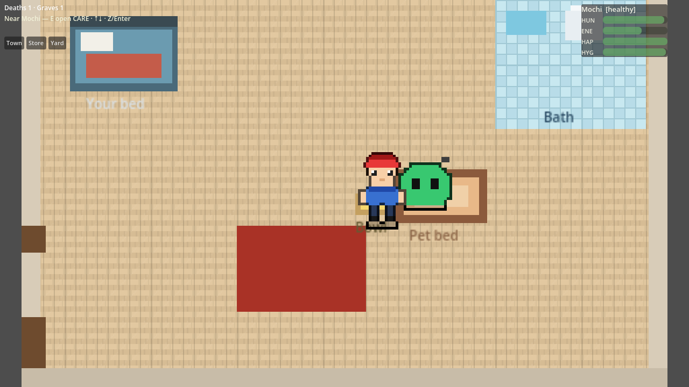
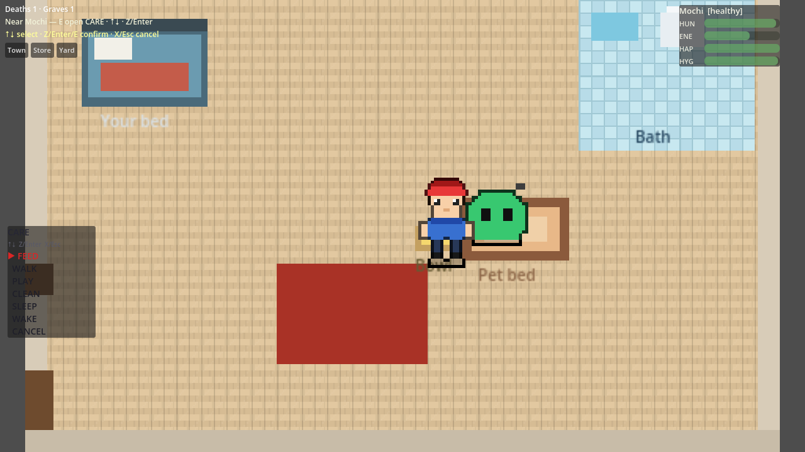
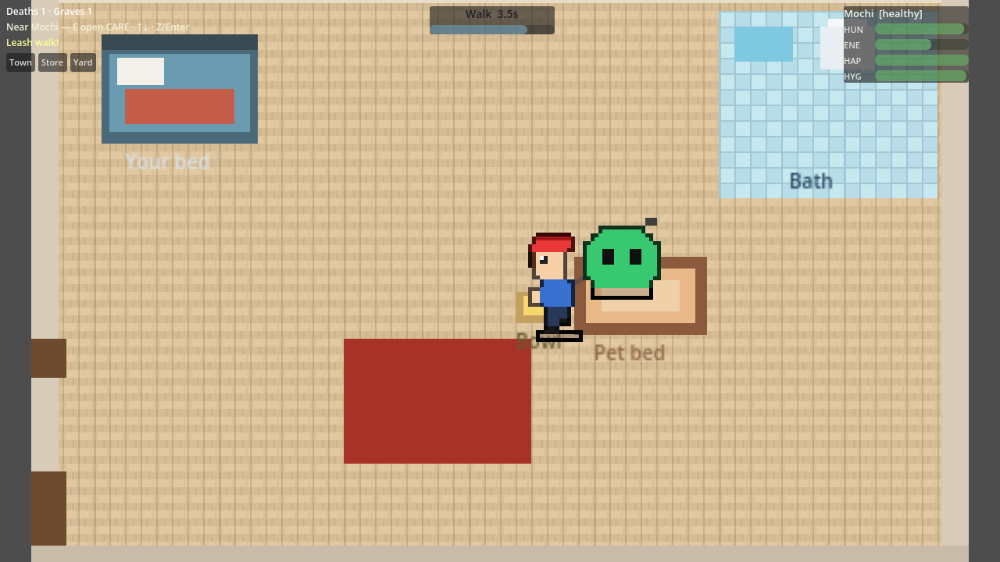
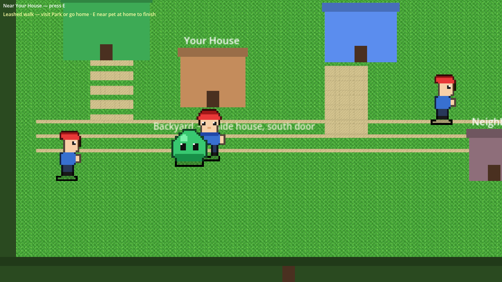
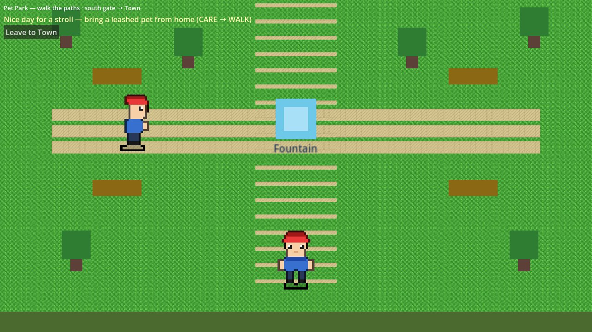
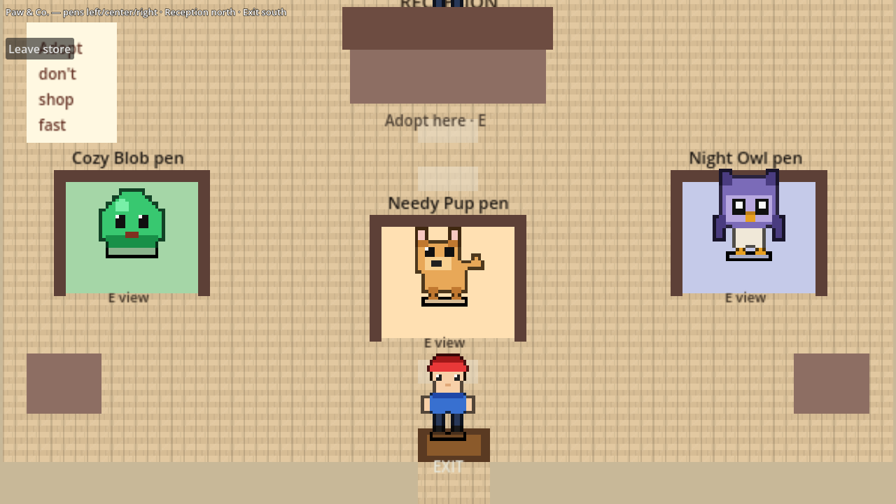
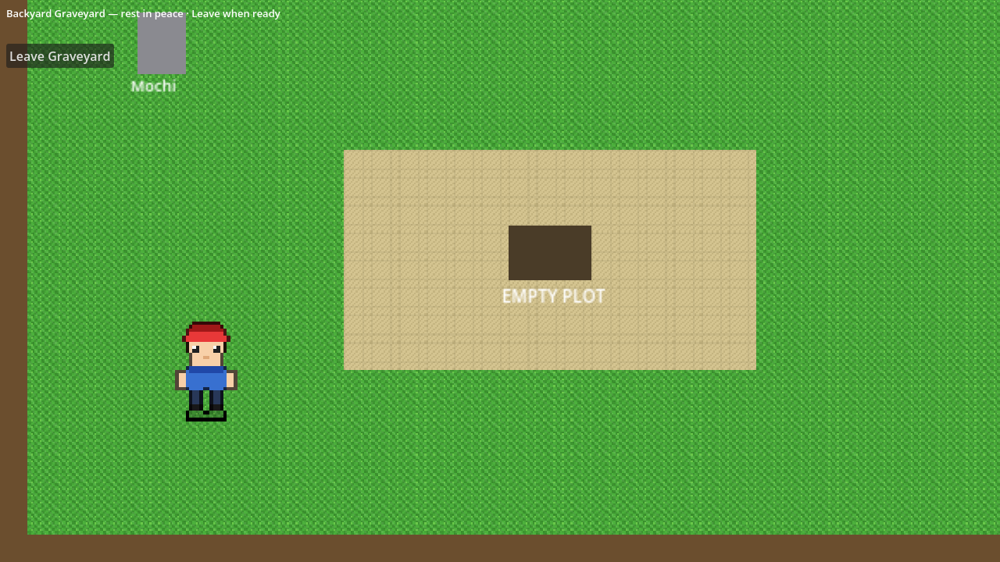
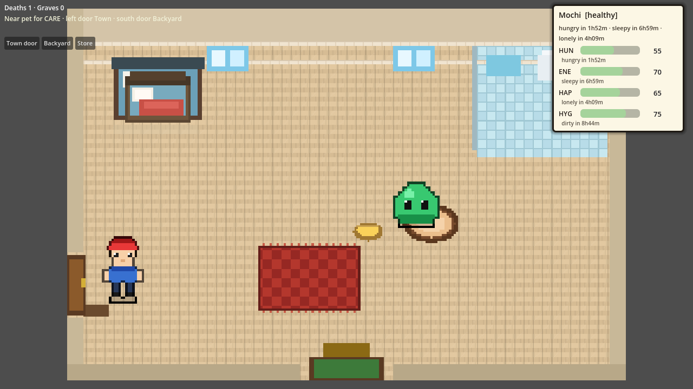

# Real-Time Virtual Pet

A **Tamagotchi-style** life sim in **Godot 4**: you play an **invincible human** in a small town. Your **one living pet** has real needs that advance with **wall-clock time**—even while the game is closed. **Neglect can permanently kill them.** Dig a grave in the backyard, remember them, then adopt again from the pet store.

| | |
|--|--|
| **Engine** | Godot **4.3+** (tested **4.7.stable**) |
| **Language** | GDScript |
| **Version** | **0.1.0** |
| **Platform** | Desktop (macOS primary; Windows/Linux export later) |
| **Design (deep dive)** | [`docs/design-real-time-virtual-pet.md`](docs/design-real-time-virtual-pet.md) |
| **Playtest notes** | [`docs/PLAYTEST-REVIEW-2026-07.md`](docs/PLAYTEST-REVIEW-2026-07.md) |
| **UX backlog** | [`docs/UX-POLISH-CHECKLIST.md`](docs/UX-POLISH-CHECKLIST.md) |
| **Public release plan** | [`docs/PUBLIC-RELEASE-POLISH-PLAN.md`](docs/PUBLIC-RELEASE-POLISH-PLAN.md) (v0.2 track) |
| **UX/UI polish plan** | [`docs/UX-UI-POLISH-PLAN.md`](docs/UX-UI-POLISH-PLAN.md) |

---

## Screenshots

<p align="center">
  
</p>

**Home** — pixel house, pet, need meters (top-right), care staging (bed / bath / bowl).

| Home · CARE menu | Leash walk (timer) |
|:---:|:---:|
|  |  |

| Town | Pet Park |
|:---:|:---:|
|  |  |

| Pet Store | Backyard graveyard |
|:---:|:---:|
|  |  |

<p align="center">
  
  <br />
  <em>Need meters with numbers and time-until (hungry / sleepy / …)</em>
</p>

---

## Quick start

1. Install **Godot 4.7** (or 4.3+).
2. Open this folder (`project.godot`) in the editor.
3. Press **F5** (Play).
4. First run: short **tutorial** → **Pet Store** (adopt) → then **town / home**.

```bash
# Optional: headless tests
godot --headless --path . -s res://tests/run_tests.gd
```

Saves live at: `user://saves/pet_save.json` (plus `.bak`).  
Onboarding flag: `user://onboarding.cfg` (`tutorial_done`).

---

## Controls

### Movement & interact

| Input | Action |
|-------|--------|
| **W A S D** or **Arrow keys** | Move human |
| **E** | Interact (doors, CARE menu, dig hold, end walk, store pens, etc.) |

### CARE menu (near living pet, in the house)

| Input | Action |
|-------|--------|
| **E** | Open CARE (must be close to pet) |
| **↑ / ↓** or **W / S** (while menu open) | Move cursor (skips greyed-out actions) |
| **Click row** | Select and confirm (mouse) |
| **Z**, **Enter**, **Space**, or **E** | Confirm selection |
| **X** or **Esc** | Cancel / close menu |
| **1–6** | Jump to care row and confirm |
| **Esc** (menu closed) | Settings (mute SFX + ambient) |

Successful care earns **❤ care points** (first earn shows a one-time tip). Spend them at the Pet Store. Park play while leashed grants an **outdoor bonus** (also tipped once).

### Debug / playtest (habitat)

| Key | Action |
|-----|--------|
| **F3** | Toggle debug text (stats, zero-hold, condition) |
| **F7** | Advance sim clock **+1 hour** |
| **F9** | Advance **+2 hours** |
| **F8** | Advance **+3 days** (usually kills a neglected pet) |

> Debug time only shifts the **sim clock offset**. Needs, cooldowns, and death still use that clock.

---

## Game loop

```
Tutorial (once)
    → Pet Store (adopt first pet if none)
    → Town / House
    → Care over real time
    → If neglected long enough: DEAD
    → Backyard: dig grave
    → Store: adopt again
```

- **Only pets** have hunger, energy, happiness, hygiene, cooldowns, sleep, and death.
- **You (and NPCs) never die** and have no vitals.

---

## Places

### Home (Habitat)

Your house. Main care stage.

| Spot | Notes |
|------|--------|
| **Near pet + E** | CARE menu |
| **Left door** | Town |
| **South door** | **Backyard** (graveyard) |
| Top-right HUD | Need **bars + numbers** + **ETAs** (e.g. “hungry in 5h”) |
| Center timer | Care / walk minimum countdown |
| **Zzz** over pet | Sleeping |

**CARE actions** (staged on-screen: walk to bowl/bath/bed, etc.):

| Action | What it does (sim) | Notes |
|--------|--------------------|--------|
| **FEED** | +hunger (clamped 0–100) | Cooldown **10 min**; diminish if re-fed within **30 min** |
| **WALK** | Leash escort outdoors | Pet **follows you** to town/park; **min 10s**; **E near pet** to finish |
| **PLAY** | +happiness, −energy/hunger | Needs enough energy |
| **CLEAN** | +hygiene (bathroom stage) | — |
| **SLEEP** | Start sleep | Shows **Zzz**; most care blocked until **WAKE** |
| **WAKE** | End sleep | Only useful while sleeping |

While **sleeping**, FEED/WALK/PLAY/CLEAN/SLEEP are greyed out—**WAKE** first.

### Town

Overworld with doorsteps (**E** to enter):

| POI | Destination |
|-----|-------------|
| **Your House** | Home |
| **Pet Park** | Park |
| **Pet Store** | Store |
| *(no separate backyard POI)* | Backyard is via **home south door** |

Neighbor buildings are scenery / ambient AI only.

### Pet Park

Open green area (paths, fountain, benches). Great for a **leashed walk**. South gate / button → town.

### Backyard (graveyard)

Attached to the house (**home south door**).

| Action | How |
|--------|-----|
| **Return home** | Walk **north** to **HOUSE DOOR** + **E**, or **Enter house** button |
| **Dig grave** | When pet is **DEAD** and unburied: stand at **EMPTY PLOT**, **hold E or Space** |

Headstones accumulate for buried pets. Counters: deaths vs graves dug (can differ if you never dig).

### Pet Store (“Paw & Co.”)

Walkable shop:

- **Pens** for **Cozy Blob**, **Needy Pup**, **Night Owl** — **E** to view / adopt UI  
- **Reception (Sam)** — finalize adopt  
- **Exit** south / Leave → town  

You can only have **one living pet**. Adopt again only after death **and** burial (store blocks while a living pet exists).

---

## Real-time simulation

### Core idea

Needs advance with **real UTC wall-clock time**:

- While the game is **open**: catch-up every **~2 seconds**.
- On **launch / resume**: catch-up from `last_sim_unix_utc`.
- **Autosave** about every **2 minutes** (and after care, death, adopt, burial).

**No hibernation.** Leaving the app does **not** freeze the pet in a safe pause forever—time still counts (capped catch-up window below).

### Day / night (presentation)

Local day phase tints the house (dawn / day / dusk / night). Daytime walk care can get a small happiness bonus.

### Need meters (HUD)

Each need shows:

- **Value** 0–100 (number + bar)  
- **ETA** from species decay, e.g. `hungry in 5h`, `sleepy in 9h`  
- Summary line under the pet name  

After care, bars **flash green** when a need rises. Feed toast shows **before → after** (e.g. `55 → 85`).

> Pets often start near **80 hunger**. Feed **+30** **clamps at 100**, so a full bar may barely move—watch the **number** and toast.

### Species (approximate care load)

| Species | Hunger decay / h | Energy / h | Happiness / h | Hygiene / h | Vibe |
|---------|------------------|------------|---------------|-------------|------|
| **Cozy Blob** | 8 | 5 | 6 | 4 | Hardy starter (~feed every 8–10h) |
| **Needy Pup** | 14 | 7 | 12 | 6 | Fragile / high attention |
| **Night Owl** | 10 | 9 | 7 | 5 | Tires while awake; strong sleep regen |

Defaults when adopted are roughly **hunger/energy/hygiene ~80**, happiness ~70 (owl energy ~75).

### Life states

Driven by worst need and zero-hold:

| State | Meaning (simplified) |
|-------|----------------------|
| **HEALTHY** | Min need ≥ 40 |
| **NEEDY** | Min need &lt; 40 |
| **CRITICAL** | Min need &lt; 15 |
| **DYING** | At least one need at **0** (hold timer running) |
| **DEAD** | Zero held long enough → permanent death |

### Death

1. A need hits **true 0** (no soft floor in MVP).  
2. **Zero-hold** accrues in real time: **6 hours** at one zero (faster if **multiple** zeros).  
3. Pet becomes **DEAD** (permanent for that life).  
4. Take them to the **backyard plot**, **hold E** to dig.  
5. Counters: `total_pets_died` vs `total_graves_dug`.  
6. Adopt a new companion at the store.

**F8** (+3 days) is the fast path to see death in playtest.

### Sleep (persists across restarts)

- **SLEEP** starts sleep; **Zzz** shows over the pet.  
- `sleep_started_unix_utc` is saved and reloaded — sleep is **real-time**, not a session flag.  
- Hunger/happiness decay **slower** while sleeping; energy **regens**.  
- **Auto-wake** only after **≥ 30 minutes** real sleep **and** energy is high (~95+), or after **max ~10h**.  
  (Prevents “put to bed with high energy → reopen already awake”.)  
- You can always **WAKE** manually.  
- Care that needs an awake pet is blocked until **WAKE**.

### Care cooldowns (real time)

| Action | Cooldown | Other gates |
|--------|----------|-------------|
| Feed | **10 min** | Diminish window **30 min** (half effect) |
| Walk | **25 min** | Min energy **15**; outdoor leash min **10 s** |
| Play | **15 min** | Min energy **20** |
| Clean | **5 min** | — |
| Sleep / Wake | (state-based) | Not both at once |

If care is on cooldown you’ll get a friendly toast (not a silent fail).

### Leash walk (important)

1. Home → CARE → **WALK** → pet is leashed.  
2. You keep **WASD** control.  
3. Use **left door** → **Town** → optional **Park**. Pet **follows**.  
4. After **≥ 10 seconds**, **E near pet** to end walk and apply walk rewards.  
5. Timer shows minimum walk remaining, then “E end walk”.  
6. **Park visit** during the walk grants an **outdoor happiness bonus** when you end the walk.  
7. At the park, **Play fetch** (button) runs outdoor **PLAY** with a park bonus (pet must be on leash from home).

### Care points & store supplies

Successful care earns soft currency **care points** (❤ in the home counter).

| Item | Cost | Effect |
|------|------|--------|
| **Premium Food** | 12❤ | Next **feed** +15 hunger (and a bit of happiness) |
| **Gentle Soap** | 10❤ | Next **clean** +15 hygiene |
| **Chew Toy** | 25❤ | Permanent: **play** +6 happiness (one purchase) |

Buy on the left **Supplies** panel inside the pet store. Earn points by caring at home and especially at the **park**.

### Home atmosphere

The house reacts to state: **bowl** empties when hungry, **mess** appears when hygiene is low, **lamp/windows** shift at night, and a short room note (e.g. “Bowl looks empty…”).

---

## Audio

`AudioService` plays short SFX from `assets/audio/`:

| Event | Sound id (examples) |
|-------|---------------------|
| Scene / door change | `door` |
| CARE open | `menu_open` |
| Menu move | `ui_click` |
| Feed / clean / sleep / wake / walk start | action tones |
| Care fail | `care_fail` |
| Dig / bury | `dig` / `bury` |
| Adopt | `adopt` |
| Soft loop | `ambient_soft` |

---

## Project layout (high level)

```
project.godot
scenes/          # habitat, town, park, store, graveyard, tutorial, main
src/autoload/    # TimeService, PetController, SceneRouter, SaveManager, AudioService, …
src/sim/         # pure needs, care, death, species, forecast (testable)
src/gameplay/    # actors, care director, sprites
assets/sprites/  # pixel art
assets/audio/    # SFX / ambient
tests/           # headless runner + cases
docs/            # design, PR standards, playtest notes
```

**Simulation core** is designed to stay pure/testable; presentation is scenes + choreography.

---

## Development

### Tests

```bash
godot --headless --path . -s res://tests/run_tests.gd
```

Coverage includes: catch-up/death matrix, care cooldowns, save v2, adopt/burial counters, species catalog, needs ETAs, scene load smoke (including park/store).

### Contributing / PRs

1. Branch from `main`.  
2. Fill the PR template; commit screenshots under `docs/pr-screenshots/`.  
3. Private repo: review images in **Files changed** (see [`docs/PR_STANDARDS.md`](docs/PR_STANDARDS.md)).  
4. Prefer CI green before merge.  

Also see [`CONTRIBUTING.md`](CONTRIBUTING.md).

### Export notes

- Create desktop export presets in the editor (not all committed).  
- F-keys are for **playtest**; gate or strip for a “store” release if needed.  
- Saves: `user://saves/pet_save.json`.

---

## FAQ

**Why didn’t hunger move when I fed?**  
Often already near **100** (clamped), or **feed cooldown (10 min)**. Watch the **numeric meter** and the feed toast.

**Why can’t I feed?**  
Pet may be **sleeping** (WAKE first), **dead**, care **cooldown**, or you’re too far / menu blocked.

**Where is the backyard?**  
**Inside the house**, **south door**—not a separate town building.

**How do I end a walk?**  
After 10+ seconds on the leash, stand **near the pet** and press **E** (home, town, or park).

**Can I have two pets?**  
Not while one is **living**. After death **and** burial, adopt again.

---

## License

TBD (source and assets in this repository). Default assumption: all rights reserved until a license file is added.
