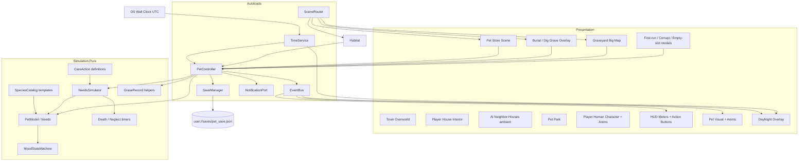
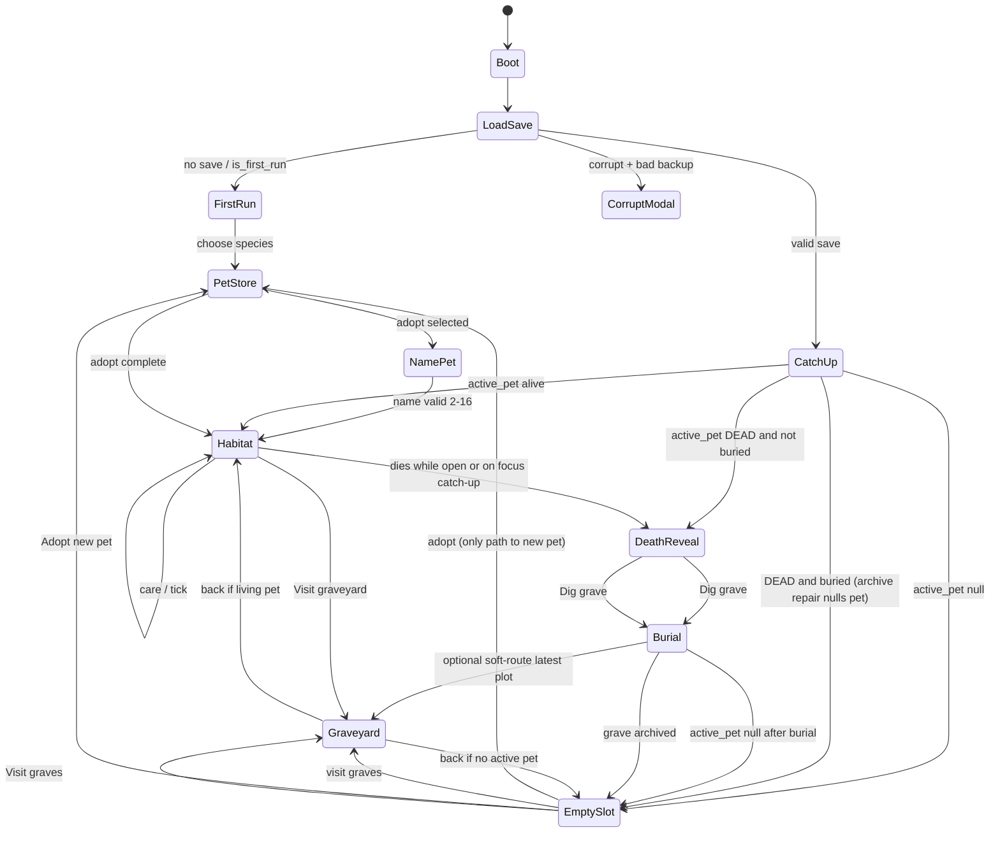
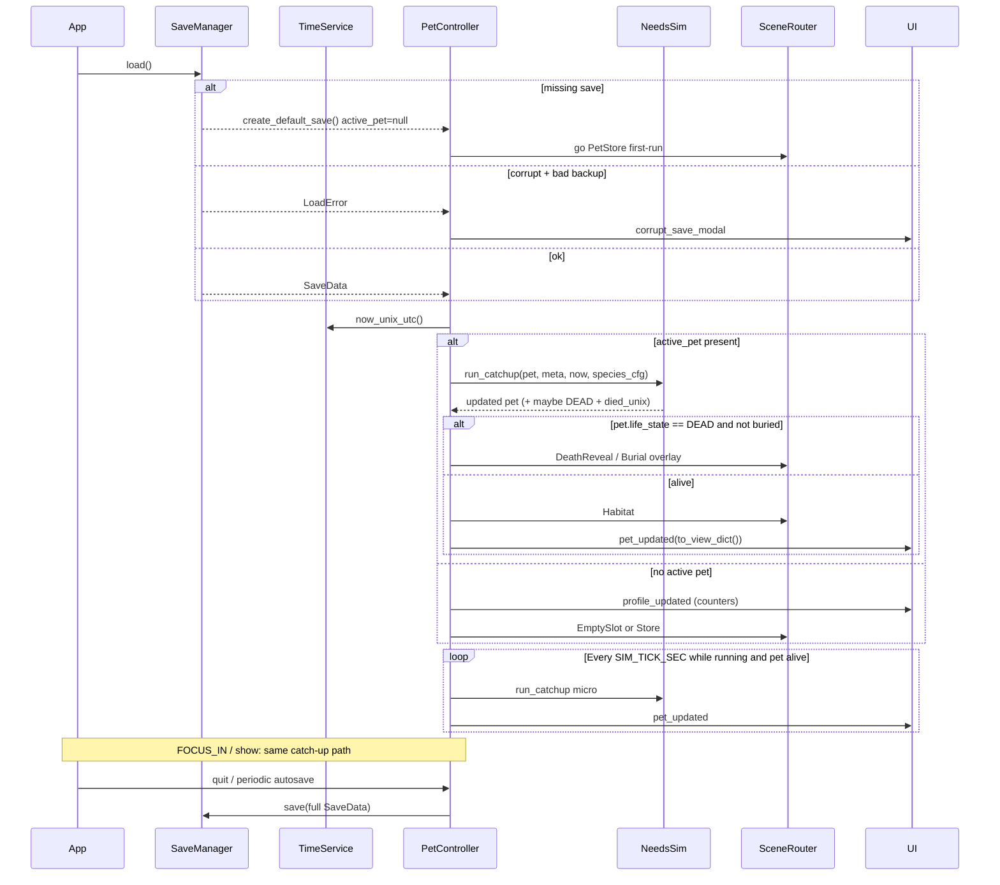
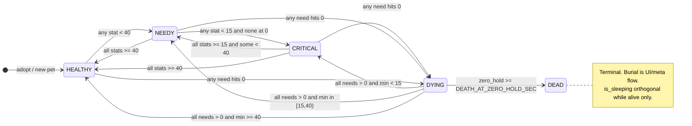
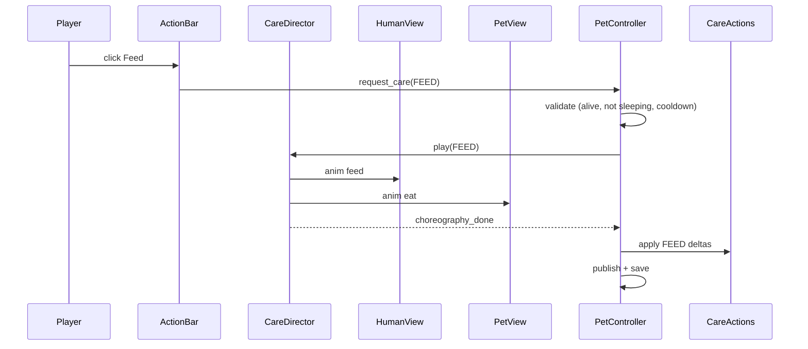
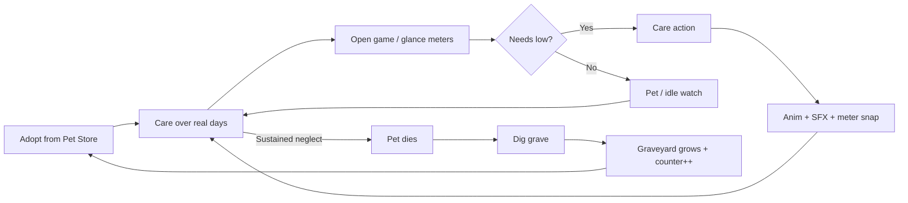
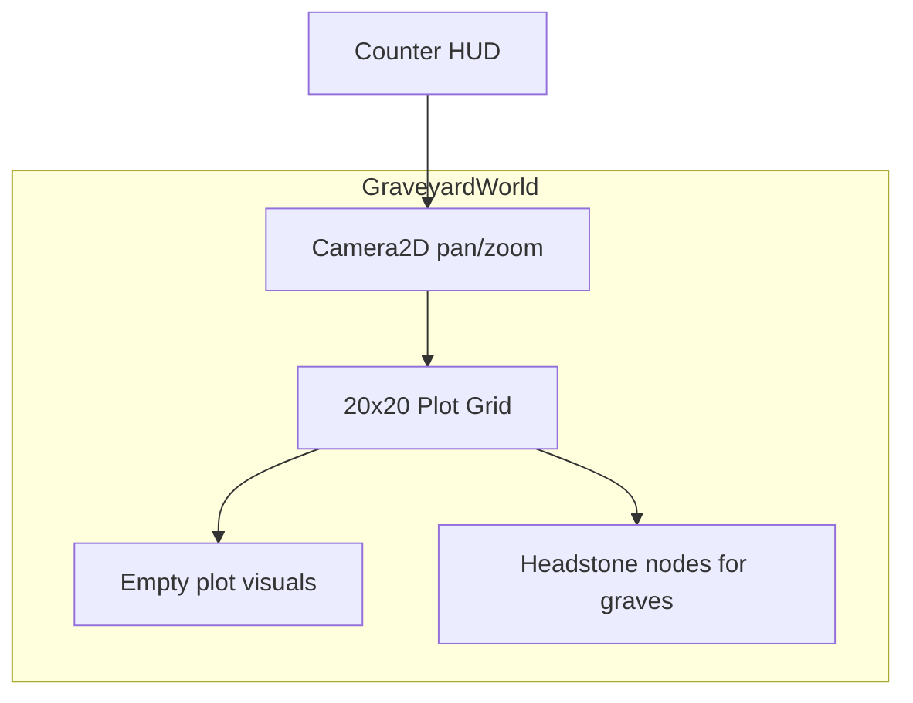

# Design Document: Real-Time Virtual Pet (Godot) — Death, Burial & Pet Store

| Field | Value |
|-------|-------|
| **Title** | Real-Time Virtual Pet — Product & System Design (Death-First) |
| **Author** | TBD |
| **Date** | 2026-07-03 |
| **Status** | Draft (rev 5.2 — town + human avatar + AI neighbors) |
| **Revision** | 5.2 (adds player human, care staging in house, small city overworld, AI houses, pet park; keeps death-first pet sim) |
| **Engine** | Godot **4.3.x** (stable 4.x baseline; known-good editor build pinned in README) |
| **Language** | GDScript 2.0 (primary) |
| **Platform (v1)** | Desktop (macOS primary playtest; Windows / Linux export later) |
| **Repo** | Greenfield at workspace root |

**Supersession note:** This document **replaces** the prior cozy default where soft floors + hibernation recovery prevented permanent death. **Death from neglect is core fantasy**, not an optional hardcore flag. Hibernation is **removed** as a long-absence survival path. **No soft floor in MVP** (`ENABLE_SOFT_FLOOR=false`): stats reach **true 0** so the death hold can start. A temporary new-life soft floor (e.g. first 24h) is **stretch only**, not MVP.

**Rev 5.2 product expansion:** The player is a **human character** living in a **small town**. Care actions are **performed on-screen by the human** (and pet) inside the house (and sometimes at the pet park). **Only pets** have needs, cooldowns, death, and burial. **Humans are invincible** — no hunger, no health, no death for any human (player or AI). Neighbor houses run **ambient AI loops** (not full multiplayer). World POIs: **player house**, **AI houses**, **pet park**, **graveyard**, **pet store**.

---

## Overview

This document specifies a **Tamagotchi-style life sim** built in **Godot 4.3.x**: you control a **human character** in a **small town**, caring for **one living pet** whose needs advance with **real wall-clock time** (including while the app is closed). **Sustained neglect permanently kills the pet.** After death you **dig a grave** in the town graveyard, track a **personal death counter**, and re-adopt from the **Pet Store** (breed care stats shown before adopt).

**Humans never die and have no vitals.** Care, feed, play, walk, clean, sleep targets are **pets only**. When you trigger a care action, you **see the human perform it** in the house (or at the pet park for outdoor actions) — not only abstract meter deltas.

The core technical problem remains a **deterministic, offline-capable pet needs simulation** driven by elapsed real time. The simulation core is pure (testable without the scene tree); presentation is a **town overworld + interior stages + character animations**. On every launch, focus/resume, and periodic open-session tick, a `TimeService` supplies UTC wall time; `PetController` runs catch-up against `last_sim_unix_utc`. Saves are local JSON.

**MVP vertical slice:** walk the small town → adopt at Pet Store → live in **your house** with human+pet care staging → neglect → pet death → burial at **graveyard** → counters → re-adopt. Neighbor houses show **AI humans (and ambient pets)** on automatic loops for life in the city.

---

## Background & Motivation

### Why this product

Classic virtual pets create attachment through **responsibility over real time**. Players check in between life events; **neglect has permanent consequences**; care feels meaningful because loss is real. Soft immortality and “hibernation until you come back” remove the classic sting and turn the pet into a pause-safe toy. This product deliberately restores **permanent death from neglect** as the default, balanced so partial care and reasonable check-ins keep the pet alive, while multi-day total abandonment is fatal.

Modern players still expect:

- Needs that continue **offline** (not “paused when closed”)
- Alignment with **their local day** (morning vs night presentation and action flavor)
- Clear feedback and low friction on desktop first
- **Informed adoption** (breed stats visible in a store before commitment)
- A **memorial space** that grows with history (graveyard + counter), not a disposable modal

### Current state

The workspace is **empty** of Godot code (docs only). There is no project, save format, or simulation code. This design is the implementation blueprint before any `project.godot` is created.

### Pain points this design addresses

| Pain point | Design response |
|------------|-----------------|
| Fake “game speed” clocks break immersion | Primary time base = OS UTC wall clock |
| Offline progress hard to reason about | Explicit `last_sim_unix_utc` + single catch-up procedure |
| DST / timezone surprises | Simulate in UTC only; local TZ for presentation/actions at click-time |
| Clock cheating (single-player) | Soft resistance + caps; no always-online anti-cheat for v1 |
| Soft immortality removes classic fantasy | Continuous decay to 0 + hold-at-zero death timer; no infinite soft floor |
| Long absence = opaque failure | Deterministic death during catch-up with `died_unix_utc` and clear cause |
| Re-adopt without consequence | Burial ritual + large graveyard + lifetime death counter |
| “Surprise” difficulty on adopt | Pet Store shows feeding frequency / hardiness / temperament before adopt |
| Art blocking gameplay | Procedural shapes + simple SFX pipeline |
| Unstructured greenfield | Phased PR plan, MVP traceability, concrete SimConfig + species templates |

### What changed from rev 4 (cozy)

| Rev 4 (superseded) | Rev 5 (this doc) |
|--------------------|------------------|
| Soft floor forever at `STAT_FLOOR=5` | **`ENABLE_SOFT_FLOOR=false` in MVP**; needs reach **true 0**; temporary new-life floor is **stretch only** |
| `HIBERNATING` + recovery care forever | **No hibernation path**; long absence continues normal decay → death |
| LifeState ends at CRITICAL/HIBERNATING | LifeState includes **`DYING`** (optional warn) and **`DEAD`** |
| Single species `"blob"` | **2–3 species templates** with different rates via Pet Store |
| Permanent death = stretch hardcore | **Permanent death is MVP core** |
| No graves / no store | **Burial flow, big graveyard, player_profile counters, Pet Store** |
| Active pet always present | **`active_pet` nullable** after burial until re-adoption |

---

## Goals & Non-Goals

### Goals (MVP)

1. **Named pet** with player-chosen name: strip control chars only; **`NAME_MIN_LEN=2`**, **`NAME_MAX_LEN=16`**.
2. One **active** pet at a time with **hunger, energy, happiness, hygiene** (0–100, higher better).
3. Care actions: **Feed, Walk, Play, Clean, Sleep/Wake** — all **instant resolve + short feedback anim/SFX**, cooldowns in real UTC.
4. **Real-time decay** while app is open *and* closed, based on elapsed wall time.
5. **Realistic permanent death from neglect** with a concrete, golden-testable algorithm (see Death model).
6. **Post-death burial:** Dig grave ritual → archive grave record → clear active pet.
7. **Personal dead-pets counter** visible in HUD/profile (`total_pets_died`, `total_graves_dug`).
8. **Big graveyard** scene: wide (**20-col**) unbounded row-major map, empty plots aesthetic, scroll/pan, headstones for buried pets (grows with deaths; not a tiny slot UI).
9. **Pet Store** with **≥2–3 species/breeds**, stats shown before adopt (feed cadence, play need, hardiness, lifespan risk copy).
10. **Timezone-aware day/night presentation** (local OS timezone); no local-hour passive decay.
11. **Local save/load** with schema version, first-run / post-death empty / corrupt-save flows.
12. **Survival LifeState** including **DEAD** + orthogonal **`is_sleeping`** + **Mood** for presentation.
13. **Deterministic simulation** core unit-testable without rendering (zero-dep test runner in repo).
14. Desktop-first Godot 4.3.x project structure ready to grow.
15. **Player human avatar** (invincible) visible performing care actions in the house / park.
16. **Small town overworld** with POIs: player house, AI neighbor houses, pet park, graveyard, pet store.
17. **AI neighbors** on automatic ambient schedules (humans invincible; neighbor pets are ambient/flavor unless promoted later).

### Non-Goals (v1)

- Multiplayer, social pets, or server-authoritative state
- Always-online anti-cheat / account binding
- Multiple **simultaneous living** pets (history of dead pets is fine)
- Full mobile push notification pipeline (optional no-op `NotificationPort` only)
- Complex 3D, physics minigames, or narrative campaign
- Timing-tap / scene-transition **minigames** (stretch; hold-to-dig is a short ritual, not a skill game)
- Monetization / IAP / paid pet unlocks (all MVP species free)
- Cloud sync (stretch later)
- User-editable balance files on disk
- **Cozy hibernation recovery that prevents death forever**
- Soft floors that permanently prevent stats from reaching 0
- Resurrection / undo death (death is permanent; adopt a new pet)
- Procedural epitaph AI / multiplayer grave visits
- Human vitals / human death / combat / crime systems
- Full simulation of every AI pet with permanent death (AI pets are **ambient** in MVP)
- Open-world city the size of a real GTA map — town is a **compact hand-authored district**
- Online multiplayer neighbors

---

## Key Decisions

| Decision | Choice | Rationale |
|----------|--------|-----------|
| Engine version | **Godot 4.3.x** (exact patch in README) | Stable 4.x baseline; portable to 4.4+ later via upgrade PR |
| Primary language | **GDScript** | Fast iteration; first-class Godot integration |
| Time storage | **`float` unix UTC seconds** | Sub-second open-session ticks; JSON-friendly |
| Time base | **UTC for simulation**; **local TZ for presentation + action-time flavor only** | Avoid DST double-counting in passive decay |
| Passive decay modifiers | **UTC rates + sleep/cross-stat only** — **no `day_phase_mult`** | Catch-up must not reconstruct local timelines in MVP |
| Offline model | **Catch-up on load/focus/tick** from single `last_sim_unix_utc` | Needs continue offline; simpler than per-stat clocks |
| Survival LifeState | **`HEALTHY \| NEEDY \| CRITICAL \| DYING \| DEAD`** | Coherent neglect → death pipeline; **no HIBERNATING** |
| Hibernation | **Removed from product & sim** | Conflicts with “realistic permanent death”; long absence is fatal, not frozen cozy |
| Soft floor | **`ENABLE_SOFT_FLOOR=false` (MVP)** — stats integrate to true 0. Temporary first-24h floor is **stretch only** (not implemented in MVP) | Soft immortality forbidden |
| Death rule | **Any core need at 0 for continuous `DEATH_AT_ZERO_HOLD_SEC` wall/sim time → DEAD**; also optional multi-need acceleration (see algorithm) | Implementable, golden-testable, classic feel |
| Health stat | **Not a fifth meter in MVP**; death derived from needs-at-zero hold timers | Fewer UI elements; same outcome; can add health later without changing fantasy |
| Post-DEAD sim | **Freeze needs**; reject care except **burial flow**; still advance `last_sim` on catch-up (no further decay) | Deterministic; no zombie care |
| Death discovery | When hold threshold crossed mid-chunk: **`died_unix_utc = sim_cursor + step * frac`** (frac from hold overshoot); tests tolerate ±`CHUNK_SEC` | Deterministic with MAX_CATCHUP; known death time for grave |
| Sleep model | **`is_sleeping: bool` orthogonal** to LifeState; **`sleep_started_unix_utc` only** | Avoid dual-field desync |
| Pet name | Strip control chars; **`NAME_MIN_LEN=2`**, **`NAME_MAX_LEN=16`** | User-confirmed product rule |
| Species | **Catalog of templates** (`species_id`); MVP **3 breeds** with different `SimConfig` profiles | Enables informed store choice |
| First run | **Pet Store (or simplified free first adopt)** → name (2–16) → habitat | Onboarding lands on adoption, not a hard-coded Mochi |
| Post-burial | `active_pet = null` → **EmptySlot mandatory** (cannot care without adopt). Soft-route may open **Graveyard** (latest plot) then empty CTAs; **adoption only via Pet Store** (not forced immediately into store) | Memorial beat + clear empty-slot state machine |
| Graveyard growth | **Unbounded row-major grid**: `COLS=20` fixed width; `plot_y` may grow past 19 (infinite scroll height). Store `plot_index` + `plot_x`/`plot_y` (unique; no page collisions). Initial framing targets a large multi-row map (“big”) | “Big graveyard” product ask; capacity grows without mod-collision |
| Burial | **Dig grave** ritual action (hold-to-dig or multi-step progress), not only a modal | Meaningful ritual |
| Player stats | `player_profile.total_pets_died` **only on first transition to DEAD** (controller after catch-up); `total_graves_dug` **only on burial**; `graves[]` | Personal counter + history; no double-count |
| `now < max_seen` | **Hard stall (MVP)** — no integration; `last_sim` unchanged | Matches golden anti-cheat tests |
| Clock manipulation | Soft mitigations (clamp forward Δt, ignore reverse, `max_seen_unix_utc`) | Single-player honesty-lite |
| Save format | **JSON** fixed paths + `schema_version` | Debuggable; easy migrations |
| Schema version | **Start at `schema_version: 2`** for death-era greenfield (no need to ship rev-4 v1 coziness) | Clean greenfield; migrators still scaffolded for future |
| Balance data | **In-repo `SimConfig` + `SpeciesCatalog` code constants** | Balance fixes = code patches |
| Living species rates | **Live catalog re-read** each sim step via `SpeciesCatalog.get(pet.species_id)` — **no rate snapshot fields on PetModel** | Balance patches affect living pets immediately; graves store identity only |
| Death profile mutation | **Controller-owned**: after `run_catchup`, if `death_committed_this_call` then `profile.total_pets_died += 1`. Pure sim never mutates profile | Pure-sim boundary + idempotent counters |
| Death event result | `CatchupResult` includes `death_committed_this_call: bool` and optional `death_detail` | Single wiring point for counters / UI |
| Architecture | Autoloads for Time/Sim/Save; pure classes for simulation | Test without scene tree |
| Care actions (MVP) | **Instant resolve + 1–2s feedback anim**; cooldowns in real UTC | Unblocks care loop early |
| Egg stage | **Skip in MVP** | Faster time-to-fun |
| Test harness | **Zero-dep `tests/run_tests.gd`** main-loop runner | Tests from PR 1 |
| Primary playtest OS | **macOS first** | Author environment |
| Process while open | Wall-clock tick every **2s** (`SIM_TICK_SEC`); UI lerp cosmetic only | Authority never from `_process` delta alone |
| Project layout | `res://src/` simulation, `res://scenes/` presentation | Clear sim vs view boundary |
| View boundary | **`PetModel.to_view_dict()`** + profile DTO on EventBus | Stable keys for HUD |
| Notifications (v1) | **`NotificationPort` no-op** behind flag | Avoid overclaim without platform code |
| MAX_CATCHUP | Still **7 days**; death must be discoverable within integrated window | Long AFK still dies if hold satisfied within integrated sim time; beyond MAX_CATCHUP, integrate only capped window then set `last_sim=now` (see death edge case notes) |
| Player entity | **Human avatar** in town + interiors; **invincible** (no needs, no HP, no death) | Care fantasy is “you looking after a pet,” not survival for the human |
| Care presentation | Care actions **stage a short human+pet animation** then apply pet sim deltas | Player *sees* feed/play/etc. happen in the house (or park) |
| World structure | **Small town map** (top-down or side-ish 2D) with fixed POIs | Store, park, graveyard, houses are places you go — not only menu scenes |
| AI houses | **Ambient AI humans** (and optional ambient pets) on timers/schedules | City feels alive; no multiplayer; AI humans invincible |
| What can die | **Player’s active pet only** (authoritative sim). AI ambient pets do not run death economy in MVP | Scope control; death still meaningful for *your* pet |
| Walk / Play location | Default **house interior**; **Walk** (and optional Play) can **route human+pet to Pet Park** for outdoor staging | Park is a real POI, not only a label |
| Navigation | **WASD** (and arrow keys) to move the human on town + walkable interiors; click POI still works as fast-travel/focus; action bar for care | Desktop standard; player *walks* the human, not only menu-hops |

---

## Proposed Design

### High-level architecture



### App flow (product state machine)



### Scene / node structure (MVP)

```
res://
  project.godot
  README.md
  src/
    autoload/
      time_service.gd
      pet_controller.gd
      save_manager.gd
      event_bus.gd
      notification_port.gd
      scene_router.gd
    sim/
      pet_model.gd
      needs_simulator.gd
      death_rules.gd          # hold timers, death commit helpers
      mood_state_machine.gd
      care_actions.gd
      life_state.gd
      sim_config.gd           # global defaults + shared constants
      species_catalog.gd      # per-species rate profiles
      grave_record.gd
      player_profile.gd
      status_copy.gd
    util/
      time_utils.gd
      clamp_utils.gd
      name_utils.gd           # sanitize, length checks
  scenes/
    main/
      main.tscn               # root host; SceneRouter target
      main.gd
    habitat/
      habitat.tscn
      habitat.gd
    pet/
      pet_view.tscn
      pet_view.gd
    graveyard/
      graveyard.tscn          # large scroll/pan map
      graveyard.gd
      plot_tile.tscn
      headstone.tscn
    store/
      pet_store.tscn
      pet_store.gd
      species_card.tscn
    burial/
      burial_overlay.tscn     # dig ritual
      burial_overlay.gd
    ui/
      hud.tscn
      action_bar.tscn
      meters.tscn
      status_banner.tscn
      death_counter_badge.tscn
      onboarding_name_modal.tscn
      corrupt_save_modal.tscn
      empty_slot_panel.tscn
    environment/
      day_night_overlay.tscn
  assets/
    art/placeholders/
      species/                # blob, pup, owl placeholders
      graveyard/
    audio/sfx/
  tests/
    run_tests.gd
    test_time_utils.gd
    test_needs_simulator.gd
    test_death_rules.gd
    test_care_actions.gd
    test_save_migration.gd
    test_catchup_matrix.gd
    test_name_utils.gd
    test_species_catalog.gd
    test_grave_archive.gd
```

**Autoload registration (order):**

1. `EventBus` — signal hub  
2. `TimeService` — clock abstraction  
3. `SaveManager` — IO only (fixed paths)  
4. `NotificationPort` — no-op  
5. `SceneRouter` — habitat / graveyard / store / burial routing  
6. `PetController` — load → catch-up → present → save; owns active pet + profile mutations  

### Runtime loop



---

## Real-Time / Offline Simulation Model

### Core invariants

1. **Simulation time is UTC.** All `last_sim_unix_utc`, cooldowns, decay, and death hold timers use float unix epoch seconds.
2. **Presentation time is local.** Day/night overlay and optional action-time bonuses use OS local datetime **at presentation or action click**, never inside passive `apply` integration.
3. **Single clock field:** one global `meta.last_sim_unix_utc` for determinism.
4. **One integration path:** open-session ticks, boot, and focus-resume all call the same `run_catchup` procedure.
5. **UI lerp is cosmetic only.** Meters snap to authority on every `pet_updated` and immediately after care.
6. **Death is pure-sim.** No scene/animation may set `DEAD` without the simulator having committed death first (presentation reacts to `life_state_changed` / burial flags).
7. **Living species rates: live catalog re-read only (MVP).** Passive rates always come from `SpeciesCatalog.get(pet.species_id)` at sim time (in-repo code constants). **Do not** persist per-pet rate snapshots on `PetModel`. Balance code patches affect all living pets on next integrate. Graves store **historical identity only** (name, species_id, timestamps, cause, plot) — never live rates.

**Stretch (not MVP):** optional rate snapshot fields at adoption if future balance must not affect long-lived pets mid-life.

### TimeService API (conceptual)

```gdscript
# res://src/autoload/time_service.gd
extends Node

var _clock_override: Callable  # test injection; empty = system

func now_unix_utc() -> float:
    if _clock_override.is_valid():
        return float(_clock_override.call())
    return float(Time.get_unix_time_from_system())

func local_datetime() -> Dictionary:
    return Time.get_datetime_dict_from_system()

func local_day_phase() -> StringName:
    # "dawn" | "day" | "dusk" | "night" from local hour only
    var h: int = int(local_datetime()["hour"])
    if h >= 5 and h < 8:
        return &"dawn"
    if h >= 8 and h < 18:
        return &"day"
    if h >= 18 and h < 21:
        return &"dusk"
    return &"night"

func is_local_night() -> bool:
    return local_day_phase() == &"night"
```

### Authoritative survival LifeState

**MVP enum (exhaustive):** `HEALTHY`, `NEEDY`, `CRITICAL`, `DYING`, `DEAD`.

**Removed vs rev 4:** `HIBERNATING`, recovery flags, hibernation enter/continue paths.

**Not in MVP:** `Content`, `Recovering`, `Egg`, `SLEEPING` as LifeState (sleep is a flag).

**`is_sleeping: bool` is orthogonal** while alive. Once `DEAD`, force `is_sleeping = false` and ignore sleep integration.

#### LifeState transition table (authoritative)

| LifeState | Enter when (evaluate after each apply chunk / action, first match) | Exit when | Notes |
|-----------|---------------------------------------------------------------------|-----------|--------|
| **DEAD** | Death rule commits (see below); terminal | Never (permanent) | Freeze stats; set `died_unix_utc`, `death_cause` |
| **DYING** | Alive, not DEAD, and **any core need ≤ 0** (independent of `zero_hold_sec`; hold is for DEAD commit only) | Care raises **all** needs &gt; 0 → recompute to CRITICAL/NEEDY/HEALTHY; or death commits → DEAD | Presentation: urgent warning window while open. A need still at 0 after partial care stays DYING |
| **CRITICAL** | Alive, not DYING/DEAD, any core stat `< CRITICAL_THRESHOLD` (15) but **no need currently at 0** | All stats ≥ 15 or drops to DYING/DEAD | |
| **NEEDY** | Alive, not CRITICAL/DYING/DEAD, any core stat `< NEEDY_THRESHOLD` (40) | All ≥ 40 or worse band | |
| **HEALTHY** | Alive, all core stats ≥ 40 | Any stat &lt; 40 | Default ok band |

**Core stats:** `hunger`, `energy`, `happiness`, `hygiene`.

```gdscript
func recompute_life_state_from_stats(pet: PetModel, cfg: SimConfig) -> void:
    if pet.life_state == LifeState.DEAD:
        return  # terminal; never recompute out of DEAD
    var mn: float = minf(pet.hunger, minf(pet.energy, minf(pet.happiness, pet.hygiene)))
    var any_zero: bool = (
        pet.hunger <= 0.0 or pet.energy <= 0.0
        or pet.happiness <= 0.0 or pet.hygiene <= 0.0
    )
    if any_zero:
        # DYING if hold not yet fatal; DEAD is only set by death commit, not here
        pet.life_state = LifeState.DYING
    elif mn < cfg.CRITICAL_THRESHOLD:
        pet.life_state = LifeState.CRITICAL
    elif mn < cfg.NEEDY_THRESHOLD:
        pet.life_state = LifeState.NEEDY
    else:
        pet.life_state = LifeState.HEALTHY
```



### Death model (authoritative algorithm)

#### Design rationale

Prefer **needs-derived death** over a fifth “health” meter so MVP UI stays four meters while still producing classic neglect death. A **hold-at-zero** timer is easier to reason about and golden-test than opaque cumulative “neglect points,” but we also track **per-stat continuous zero holds** so partial care that clears zeros **resets** the fatal clock (rewarding intervention).

#### Constants (global, see Appendix)

| Constant | MVP value | Meaning |
|----------|-----------|---------|
| `DEATH_AT_ZERO_HOLD_SEC` | **6 hours** (`21600`) | Continuous sim time with **at least one** core need ≤ 0 → commit DEAD |
| `DEATH_MULTI_ZERO_HOLD_RATE` | **2.0** | If **≥2** core needs ≤ 0, `hold_delta = step * 2.0` (effective fatal window **~3h**). Single-zero uses rate **1.0** |
| `ENABLE_SOFT_FLOOR` | **`false`** | Stats integrate to true 0 |
| `MAX_CATCHUP_SEC` | 7 days | Cap integrated neglect per catch-up call |
| `CHUNK_SEC` | 60 | Integration step for mid-window death discovery |

**Removed:** `STAT_FLOOR` as permanent clamp; `HIBERNATE_AFTER_SEC`; hibernation rate mult; recovery flags.

#### Per-pet death-tracking fields

```text
zero_hold_sec: float          # continuous sim-seconds with ≥1 need at 0; reset when all needs > 0
died_unix_utc: float          # 0 if alive; set once on death commit
death_cause: StringName       # "" | "neglect" | future causes
buried: bool                  # false until burial completes
```

Optional internal (not required in save if re-derived): which stats are zero — recompute each chunk from stats.

#### Integration rule (inside each normal chunk of length `step`)

**MVP precision policy (authoritative):**
- Integrate the **full** `step`, then evaluate zero state at **end of chunk**.
- Stat zero-crossing **within** a chunk is **not** sub-step accurate; hold time for a need that first hit 0 mid-chunk may be overstated by at most **`CHUNK_SEC` (60s)**.
- Mid-chunk **`frac`** only refines when the **hold bar** completes mid-step (death timestamp), not when a stat first reaches 0.
- Golden multi-zero / death-hold tests **should start with stats already at 0** when asserting exact hold duration.
- Tests for `died_unix_utc` accept tolerance **±`CHUNK_SEC`** (prefer already-at-zero setups for hold-fill assertions).

```
# Preconditions: pet.life_state != DEAD

1. Integrate needs for `step` using species rates, sleep/awake, cross-stat mults.
2. Clamp each stat to [0, 100].  # NO soft floor when ENABLE_SOFT_FLOOR is false
3. Sleep auto-wake checks (unchanged intent): energy >= AUTO_WAKE or elapsed >= MAX_SLEEP
4. any_zero = any core stat <= 0
5. zero_count = count of core stats <= 0
6. if not any_zero:
       pet.zero_hold_sec = 0.0
       hold_delta = 0.0
   else:
       # AUTHORITATIVE single formula:
       hold_rate = cfg.DEATH_MULTI_ZERO_HOLD_RATE if zero_count >= 2 else 1.0
       # DEATH_MULTI_ZERO_HOLD_RATE = 2.0 → multi-zero accrues hold twice as fast
       hold_delta = step * hold_rate
       pet.zero_hold_sec += hold_delta
7. if pet.zero_hold_sec >= cfg.DEATH_AT_ZERO_HOLD_SEC:
       # Death may complete mid-chunk relative to HOLD fill (not stat zero-crossing):
       overshoot = pet.zero_hold_sec - cfg.DEATH_AT_ZERO_HOLD_SEC
       frac = 1.0
       if hold_delta > 0.0:
           frac = clampf(1.0 - overshoot / hold_delta, 0.0, 1.0)
       newly_dead = commit_death(pet, sim_cursor + step * frac, &"neglect")
       # Caller ORs newly_dead into CatchupResult.death_committed_this_call
       # Stop further need integration for remaining catch-up (pet is DEAD)
8. else:
       recompute_life_state_from_stats(pet, cfg)
```

```gdscript
## Pure pet mutation only — NEVER touches PlayerProfile.
## Returns true if this call newly transitioned the pet into DEAD.
func commit_death(pet: PetModel, died_at_unix: float, cause: StringName) -> bool:
    if pet.life_state == LifeState.DEAD:
        return false  # idempotent: already dead
    pet.life_state = LifeState.DEAD
    pet.died_unix_utc = died_at_unix
    pet.death_cause = cause
    pet.sleep_started_unix_utc = 0.0  # is_sleeping derived from this
    pet.buried = false
    # Freeze: leave need values as-is at death (often zeros)
    return true
```

#### CatchupResult / death event (authoritative wiring)

```gdscript
class_name CatchupResult
var events: Array  # optional log events
var death_committed_this_call: bool = false
var death_detail: Dictionary = {}  # { died_unix_utc, cause, name, pet_id } if death_committed_this_call
var life_state_before: StringName
var life_state_after: StringName

# NeedsSimulator.run_catchup(...):
#   life_state_before = pet.life_state at entry
#   if already DEAD: no integrate; COMMIT clock; death_committed_this_call = false
#   else integrate; commit_death may return true once
#   death_committed_this_call =
#       (life_state_before != LifeState.DEAD and pet.life_state == LifeState.DEAD)
#   if death_committed_this_call:
#       death_detail = { died_unix_utc, cause, name, pet_id }
#   return CatchupResult
```

**Controller-owned profile mutation (only place `total_pets_died` changes):**

```gdscript
# PetController after run_catchup:
var result: CatchupResult = NeedsSimulator.run_catchup(pet, meta, now, cfg)
if result.death_committed_this_call:
    profile.total_pets_died += 1  # exactly once per first transition to DEAD
    EventBus.pet_died.emit(result.death_detail)
# Pure sim never increments profile.
# Re-load of already-DEAD unburied pet: entry life_state==DEAD →
# death_committed_this_call=false → counter unchanged.
# Save pet+profile atomically after applying this mutation.
```

**Idempotency guarantees:**
1. `commit_death` no-ops if already `DEAD` (returns `false`).
2. Catch-up entry when `life_state == DEAD` does not re-enter death integration.
3. `death_committed_this_call` is true **iff** pet entered this catch-up with `life_state != DEAD` and exited `DEAD`.
4. Therefore re-load of an already-`DEAD` unburied pet **never** re-increments `total_pets_died`.
5. No separate `death_accounted` flag required when transition detection is pre/post `life_state` in one call **and** pet+profile are saved atomically after the controller increment. Boot validation still repairs impossible states (see **Load / archive repair**).

#### Post-DEAD behavior

| Concern | Behavior |
|---------|----------|
| Further passive decay | **None** — skip integrate when `life_state == DEAD` |
| Care actions | **All rejected** except controller routing to burial (`reason: PET_DEAD`) |
| Catch-up when already DEAD | **No stat changes**; still **COMMIT** `last_sim = now` so clock advances |
| Sleep | Forced off on death |
| Mood | Presentation maps DEAD to special dead pose; Mood FSM returns `DEAD` or skips |
| Open-session tick | May no-op sim if DEAD; UI shows death/burial CTA |

#### Why not hibernation (rejected for this product)

Hibernation freezes or near-freezes needs after long absence, then recovers with Feed/Clean/Rest. That **prevents** permanent death from the very absences that should kill the pet in a “realistic neglect” fantasy. Optional future **debug flag** `ENABLE_LEGACY_HIBERNATION` is **not** in MVP and must default off if ever reintroduced.

#### MAX_CATCHUP interaction with death

- `sim_dt = min(raw_dt, MAX_CATCHUP_SEC)` still applies.
- Death is evaluated **only on integrated `sim_dt`**.
- **Edge case:** If the player is gone **longer than MAX_CATCHUP** but death would have occurred **within** the first 7 days of absence, chunk integration of 7 days **will** still hit the zero-hold threshold (death occurs early in a multi-day absence once needs hit 0 and hold elapses).  
- **Edge case:** Extremely weird tiny rates where 7 days of integration would not reach death: not expected with MVP rates (hunger empties in hours). Golden tests cover 2h / 3d / 7d.
- After death mid-catch-up, remaining chunks are **no-ops** (already DEAD); `last_sim` still becomes `now` on COMMIT (player does not “resume” pre-death time).

#### Golden death / neglect cases (authoritative tests)

| Case | Setup | Expect |
|------|--------|--------|
| **2h neglect** | Full stats, awake, species default blob rates, `raw_dt=2h` | Needs drop but **not DEAD**; hunger ≈ start − 2×rate; `zero_hold_sec==0` if no stat hit 0 |
| **3d neglect** | Full stats, awake, blob, `raw_dt=3d` | **DEAD**; `death_cause==neglect`; `died_unix_utc` in `(last_sim, now]`; needs frozen at death values |
| **7d neglect** | Same, `raw_dt=7d` (and 8d capped) | **DEAD** within integrated window; `last_sim==now` after COMMIT |
| **Partial care prevents death** | Sim to hunger=0 for 3h hold, then Feed raises hunger &gt; 0 before hold hits 6h | `zero_hold_sec` **reset**; still alive; life_state not DEAD |
| **Multi-zero accelerates** | Force hunger=0 and energy=0 (start already at zero); integrate with `DEATH_MULTI_ZERO_HOLD_RATE=2.0` | DEAD after **≈3h** hold (half of 6h single-zero); `total_pets_died` +1 via controller once |
| **Sleep does not prevent starvation death** | Sleeping while hunger already 0 | Hold still accumulates (sleep slows hunger decay but once at 0, hold runs) |
| **Feed while DYING** | hunger 0, hold 2h, Feed +30 | alive; hold cleared; DYING→NEEDY/CRITICAL/HEALTHY per stats |
| **Already DEAD catch-up** | DEAD, buried false, +2d | still DEAD; stats unchanged; `last_sim` updates; **`death_committed_this_call=false`** (counter not in pure sim; controller must not +1) |
| **Reverse clock** | `now < last_sim` | no death undo; stats unchanged; last_sim unchanged |
| **Behind max_seen** | `now < max_seen` | hard stall; no integration |
| **Death mid-chunk timestamp** | Start already at zero; construct hold so bar completes mid-step | `died_unix_utc = sim_cursor + step*frac` within chunk; tests tolerate **±CHUNK_SEC**; zero-crossing of stats within chunk is **not** sub-step accurate |


**Also required:** Appendix D product matrix (counters D1–D2, burial D3–D5, adopt D6–D9, name D10–D13, immortality regressions D14–D16, archive repair D17, plot uniqueness D18).

**Approximate timeline for default blob (awake, no care) — Appendix B rates only (`HUNGER_DECAY_PER_HOUR=8.0`):**

- Hunger **80 → 0** at 8/h ≈ **10h** from default starter; from full **100 → 0** ≈ **12.5h**.
- Then **+6h** single-zero hold → death from hunger neglect alone ≈ **~16h** from default (10h + 6h), or ≈ **~18.5h** from full if only hunger zeros first.
- Other stats also decay (happiness/energy/hygiene) and may multi-zero sooner (`DEATH_MULTI_ZERO_HOLD_RATE=2.0` → ~3h hold once ≥2 needs at 0).
- **3 days idle:** definitely dead under MVP rates.
- **2 hours idle from full/default:** alive; needs drop but no death (`zero_hold_sec==0` if no stat hit 0).

### Sleep model and offline auto-wake

**Source of truth (authoritative):** persist **only** `sleep_started_unix_utc` (`0` = not sleeping).  
**Derive** `is_sleeping == (sleep_started_unix_utc > 0)` while alive (and false when DEAD).

**Load rule:** after deserialize, **always recompute** any in-memory `is_sleeping` from `sleep_started_unix_utc`; **ignore** a stale persisted bool if one appears in old test fixtures. Prefer **not** writing `is_sleeping` to JSON in schema v2 (view DTO may still expose derived bool).

While sleeping (alive only):

| Rate | Behavior |
|------|----------|
| Energy | Regenerates at `ENERGY_SLEEP_REGEN_PER_HOUR` (species-scaled if defined) |
| Hunger | Decays at hunger rate × `SLEEP_HUNGER_MULT` (0.5) |
| Happiness | Decays at happiness rate × `SLEEP_HAPPINESS_MULT` (0.5) |
| Hygiene | Normal awake hygiene rate (MVP) |

**Auto-wake:** after each sleeping chunk, if `energy >= AUTO_WAKE_ENERGY` (95) **OR** elapsed ≥ `MAX_SLEEP_SEC` (10h): clear sleep; remaining chunks awake.

Care Walk/Play/Feed/Clean require `not is_sleeping` and `life_state != DEAD`. Sleep/Wake rejected if DEAD.

### Ordered catch-up algorithm (authoritative)

Single procedure used on **boot**, **focus/resume**, and **open-session ticks** when `active_pet != null`.

```
1. now = TimeService.now_unix_utc()
2. If active_pet == null: return (profile-only session; no pet sim)

3. raw_dt = now - meta.last_sim_unix_utc

4. Reverse clock / historic-peak stall (NO COMMIT; never move last_sim backward):
   4a. if now < meta.last_sim_unix_utc:
          record TIME_WENT_BACKWARDS
          meta.max_seen_unix_utc = max(meta.max_seen_unix_utc, meta.last_sim_unix_utc)
          return  # last_sim unchanged
   4b. if now < meta.max_seen_unix_utc:
          record TIME_BEHIND_MAX_SEEN
          return  # last_sim unchanged

5. meta.max_seen_unix_utc = max(meta.max_seen_unix_utc, now)

6. If pet.life_state == DEAD:
       # No integration; still commit clock forward
       goto COMMIT

7. sim_dt = min(raw_dt, cfg.MAX_CATCHUP_SEC)
   sim_cursor = meta.last_sim_unix_utc
   species_cfg = SpeciesCatalog.rates_for(pet.species_id)  # merged with global cfg

8. Normal path only (NO hibernation branch):
   remaining = sim_dt
   while remaining > 0 and pet.life_state != DEAD:
       step = min(remaining, cfg.CHUNK_SEC)
       apply_chunk_normal(pet, step, sim_cursor, species_cfg)
       # apply_chunk includes death hold + possible commit_death
       sim_cursor += step
       remaining -= step
   if pet.life_state != DEAD:
       recompute_life_state_from_stats(pet, species_cfg)

9. COMMIT:
   meta.last_sim_unix_utc = now
   meta.max_seen_unix_utc = max(meta.max_seen_unix_utc, now)
   return events
```

**`apply_chunk_normal`:** integrate sleep/awake rates → clamp [0,100] → auto-wake → **death hold update** → maybe `commit_death` → else stats life-state recompute.

### Needs model

Four primary stats in **[0.0, 100.0]**, all **higher is better**:

| Stat | Meaning | Raised by |
|------|---------|-----------|
| **Hunger** | Fullness | Feed |
| **Energy** | Restedness | Sleep (regen) |
| **Happiness** | Mood fuel | Play, Walk, good care |
| **Hygiene** | Cleanliness | Clean |

### Decay curves (passive `apply` only)

```text
dStat/dt = species_base_rate[stat] * sleep_or_awake_mult * cross_stat_mult
# NO day_phase_mult in passive simulation
# NO permanent soft floor
```

Cross-stat multipliers (awake), global:

- If `hunger < 25`: happiness decay ×1.5  
- If `energy < 20`: happiness decay ×1.3  
- If `hygiene < 20`: extra happiness −1.0 /h  

Exact base rates: **[Appendix A](#appendix-a-global-simconfig--death-constants)** and **[Appendix B](#appendix-b-species-catalog-mvp)**.

### Timezone handling

| Concern | Approach |
|---------|----------|
| User timezone | OS local for UI/day-night and action-time bonuses only |
| DST | UTC passive sim unaffected |
| Travel / TZ change | UTC continuity; day phase may jump — acceptable |
| Multi-day catch-up | Does **not** sample local phase per chunk |

### Clock changes / cheating resistance

| Mitigation | Notes |
|------------|-------|
| `sim_dt = min(raw_dt, MAX_CATCHUP_SEC)` | Caps forward skip benefit |
| `raw_dt < 0` → no reverse sim | Prevents undoing neglect / death |
| `max_seen_unix_utc` hard stall | `now < max_seen` → no integration |
| Care cooldowns in UTC | Same clock family |
| Death not reversible by clock | DEAD is sticky in save; reverse does not un-die |
| No network time in MVP | Offline-first |

### Day/night cycle (presentation + action-time only)

- Overlay modulate from `TimeService.local_day_phase()`.
- **Action-time example:** Walk grants base happiness; if phase is `day` **at click**, add day bonus. **Never** during passive catch-up.
- Auto-suggest sleep if local night **and** `energy < 40` (banner only), pet alive.

---


---

## World, Human Character & Town (rev 5.2)

### Product intent

The game is no longer “meters + a floating pet.” You are a **person in a small city block**. Your job is to **care for your pet**. When you Feed, Play, Clean, etc., you **watch your human do that action** at home (or at the park). Neighbors live their own automatic lives so the town feels inhabited. **Pets can die from neglect. Humans cannot.**

### Entity rules (authoritative)

| Entity | Player-controlled? | Needs / vitals | Can die? | Notes |
|--------|--------------------|----------------|----------|--------|
| **Player human** | Yes (navigate + trigger care) | **None** | **No — invincible** | No hunger, HP, energy, aging death |
| **Player’s active pet** | Indirectly (via care actions) | hunger, energy, happiness, hygiene | **Yes** | Sole authoritative death sim |
| **AI humans** (neighbors) | No | **None** | **No — invincible** | Ambient schedules only |
| **AI ambient pets** | No | Optional fake meters for show only | **No (MVP)** | Visual loops; not in `player_profile` death economy |
| **Store clerk (optional NPC)** | No | None | No | Flavor at Pet Store |

**Invariant:** Any code path that applies decay, cooldowns, `zero_hold_sec`, or `commit_death` targets **`active_pet` only**. Human nodes never call `NeedsSimulator`.

### Small town layout (MVP hand-authored)

Compact single district (not an open-world metropolis). Suggested fixed POIs on a top-down (or 3/4) 2D map:

```text
                 [ Pet Park ]
                     |
[ AI House A ] -- [ Plaza ] -- [ Pet Store ]
                     |
              [ Player House ]
                     |
            [ AI House B ] -- [ Graveyard ]
```

| POI | Player can | Presentation |
|-----|------------|--------------|
| **Player house** | Enter; full care UI; human+pet care staging; sleep | Primary interior scene |
| **AI houses** | Optional knock/peek or exterior-only in MVP | Windows/doors show AI loops; enter = stretch |
| **Pet park** | Enter with pet for **Walk** (and optional **Play**) outdoor staging | Open area, simple props, other AI walkers |
| **Pet store** | Enter; browse breeds; adopt | Interior or counter UI + town entrance |
| **Graveyard** | Enter; dig grave; pan/zoom headstones; counters | Large memorial map (existing design) |

**Travel (MVP):**

1. **Primary: WASD / arrow keys** move the **player human** on the town map and in walkable interiors (house, park, store floor, graveyard paths).
2. **Secondary: click POI** (or click ground) as optional pathing / fast focus on a building entrance.
3. **Enter / interact** on door or `E` / click when in range to enter POI interiors (or automatic enter on door tile).

Implementation preference: **one continuous (or large) town hub with collision** so WASD feels real; heavy interiors may still be separate scenes entered via doors. Camera **follows the human** (soft follow, clamp to map bounds).

### Player human controls

| Input | Context | Effect |
|-------|---------|--------|
| **W A S D** | Town, house, park, store floor, graveyard paths | Move human (8-dir or 4-dir; MVP **4-dir grid-friendly or free 8-dir top-down** — pick free top-down 8-dir with normalized diagonal) |
| **Arrow keys** | Same as WASD | Same movement (accessibility / preference) |
| **Shift** (optional) | Town / park | Mild sprint; **no stamina cost** (human invincible, no energy meter) |
| **E** or **Enter** / click door | In interact range of POI | Enter building / start interact prompt |
| Click POI icon / ground | Town | Optional path-to or camera focus; **does not replace WASD** |
| Action bar: Feed, Play, Clean, Sleep/Wake | **Inside player house** (pet alive, rules as care table) | Play **care choreography** then apply pet sim (movement locked mid-anim) |
| Action bar: Walk | House or town | If not at park: path or prompt to go to **Pet Park**; then outdoor walk choreography + walk deltas |
| Hold **LMB** / hold **Space** on dig prompt | Graveyard + pet DEAD unburied | Burial ritual (human digs) |
| Click headstone | Graveyard | Inspect grave (can also WASD next to it + **E**) |
| Store UI (mouse + typing) | Pet Store counter UI | Select breed, type name 2–16, adopt |
| **Esc** | Interiors / modals | Close modal or return toward town (confirm if needed) |
| **1–6** (optional MVP-nice) | House, care unlocked | Hotkeys for Feed / Walk / Play / Clean / Sleep-Wake / (reserved) |

**Movement rules:**

- Human collision against buildings, fences, water; no fall damage / no death.
- While **care choreography** or **burial dig** plays: **WASD disabled** until finished.
- Pet follows loosely in town/park when living (simple follow offset); not a second controllable character.
- AI humans use their own simple move loops; they do not block the player permanently (soft collision or thin colliders).

**Input map (Godot):** actions `move_up`/`move_down`/`move_left`/`move_right` bound to WASD **and** arrows; `interact` → `E`; `sprint` → `Shift` (optional).

### Care choreography (human does the action)

Sim resolution stays **instant** under the hood (cooldowns, deltas unchanged). Presentation **always** plays a short staged sequence (~1–2.5s) before/as meters update:

| Action | Default stage location | Human animation (placeholder OK) | Pet reaction |
|--------|------------------------|----------------------------------|--------------|
| **Feed** | House kitchen / bowl | Human walks to bowl, pours food | Pet eats |
| **Play** | House living room **or** park | Human plays with toy / throws ball | Pet plays |
| **Clean** | House bath/mat | Human bathes/brushes pet | Pet shake-off |
| **Sleep** | House bed/cushion | Human tucks pet in / turns light down | Pet sleeps (Zzz) |
| **Wake** | House | Human calls / opens curtains | Pet wakes |
| **Walk** | **Pet park** path | Human walks pet on path | Pet trots |
| **Dig grave** | Graveyard plot | Human digs with shovel | Pet body → headstone |

While a choreography is playing: action bar **locks** until done (no double-apply). Cancel not required in MVP.



`CareDirector` is presentation-only; **validation and deltas remain in pure/controller layers** so headless tests still work without animations (tests call apply directly; optional flag `skip_choreography` for debug).

### AI neighbors (ambient life)

- **Count MVP:** 2–4 exterior AI houses + 0–3 park walkers.
- **Human AI:** simple state machine on real or scaled display time: idle at window → exit → walk loop on sidewalk → return. **Never** affected by player care; **never** die.
- **Ambient pets:** optional leashed sprites that follow AI humans or sit in yards. **No** `commit_death`, **no** contribution to `total_pets_died`.
- **Offline:** AI does not need full catch-up; on load, pick a schedule phase from `now` local time so town looks correct immediately.
- **Stretch:** AI pets with simplified needs (non-fatal); visit AI homes; gifts.

### What stays the same (pet sim)

Death model, catch-up, cooldowns, counters, species catalog, JSON save of `active_pet` + `player_profile` — **unchanged authority**. Town/human are **presentation + navigation** layers on top.

### Save additions (rev 5.2)

Optional lightweight fields (defaults fine if missing):

```json
"player_human": {
  "display_name": "",
  "last_town_poi": "player_house",
  "pos_x": 0.0,
  "pos_y": 0.0
}
```

No human vitals. AI state need not be persisted in MVP (reseed from clock).

---

## Pet Care Loop / Game Design

### Player fantasy

“I have a small creature that lives on my machine and needs me across the real day. If I abandon it, it can die — and I will remember it in the graveyard.”

### Core loop



### Care actions (MVP) — all instant resolve

All five actions: **validate → apply deltas immediately → emit events → short 1–2s feedback anim/SFX**. No blocking minigame UI in MVP (except burial ritual progress).

| Action | Preconditions | Effects (defaults; species may scale care efficacy stretch) | Cooldown |
|--------|---------------|--------------------------------------------------------------|----------|
| **Feed** | alive; `not is_sleeping` | Hunger +30; Hygiene −2; Happiness +5 if hunger was &lt; 40 | 10 min real |
| **Walk** | alive; `not is_sleeping`; energy ≥ 15 | Happiness +15 (+3 if local day at click); Hunger −8; Energy −12; Hygiene −10 | 25 min |
| **Play** | alive; `not is_sleeping`; energy ≥ 20 | Happiness +20; Energy −10; Hunger −5 | 15 min |
| **Clean** | alive; `not is_sleeping` | Hygiene +40; Happiness +5 if hygiene was &lt; 40 | 5 min |
| **Sleep** | alive; `not is_sleeping` | `is_sleeping = true`; set `sleep_started_unix_utc = now` | none |
| **Wake** | alive; `is_sleeping` | clear sleep | none |

**Diminishing returns:** second Feed within 30 real minutes restores hunger ×0.5.

**Death reset interaction:** successful Feed/Play/etc. that raise all stats above 0 clears `zero_hold_sec`.

### Feedback

- Four meters; color green→yellow→red by thresholds 40/15; **flash/pulse at 0 / DYING**
- Pet anims by Mood + `is_sleeping` + LifeState (dead pose when DEAD)
- Status banner priority: **DEAD/burial CTA** &gt; **DYING** &gt; CRITICAL &gt; NEEDY &gt; sleep &gt; idle
- Action toast with deltas
- **Death counter badge** always visible (profile): `total_pets_died` / graves
- `NotificationPort.notify_critical_if_unfocused()` no-op in MVP

### Mood derivation (ordered, first match wins)

Moods: `DEAD | DYING_MOOD | ECSTATIC | HAPPY | NEUTRAL | BORED | SAD | ANGRY | SICKLY | SLEEPY`

| Priority | Mood | Condition |
|----------|------|-----------|
| 0 | **DEAD** | `life_state == DEAD` |
| 1 | **SLEEPY** | derived `is_sleeping` |
| 2 | **DYING_MOOD** | `life_state == DYING` OR any need ≤ 0 (always this enum — not co-equal with SICKLY) |
| 3 | **SICKLY** | `life_state == CRITICAL` OR hunger &lt; 15 OR energy &lt; 15 |
| 4 | **ANGRY** | hygiene &lt; 20 AND happiness &lt; 35 |
| 5 | **SAD** | happiness &lt; 30 OR (hunger &lt; 25 AND not sleeping) |
| 6 | **BORED** | happiness &lt; 50 AND energy ≥ 40 AND hunger ≥ 40 |
| 7 | **ECSTATIC** | happiness ≥ 80 AND hygiene ≥ 50 AND hunger ≥ 50 AND energy ≥ 40 |
| 8 | **HAPPY** | happiness ≥ 60 |
| 9 | **NEUTRAL** | default |

### Session length targets

- Glance: 10–30 s  
- Care: 1–3 min  
- Balance target: **2–4 meaningful check-ins per waking day** for medium species; easy species more forgiving; needy species more demanding (store copy must match)

### DYING warning window (while open)

When `life_state == DYING` or any need at 0:

- Full-screen-safe banner: “{name} is in danger — feed and care for them!”
- Optional heartbeat SFX (stretch)
- Meters at 0 show cracked/empty art
- No soft lock; player can still use all care actions

---

## Burial / Graveyard

### Product intent

Death is not a dismissible error. The player **discovers** the dead pet, **digs a grave**, and the pet is **remembered** in a large graveyard. The counter makes history legible.

### Burial flow

```mermaid
sequenceDiagram
  participant Player
  participant Habitat
  participant Burial as Burial Overlay
  participant Controller as PetController
  participant Save as SaveManager
  participant Yard as Graveyard

  Note over Controller: catch-up set DEAD, buried=false
  Controller->>Habitat: show dead pet + CTA "Dig a grave"
  Player->>Burial: start Dig Grave
  Burial->>Burial: hold-to-dig progress 0→1 (2–4s) or 3 shovel stages
  Burial->>Controller: complete_burial(optional_epitaph?)
  Controller->>Controller: allocate plot; build GraveRecord
  Note over Controller: total_pets_died already +1 at death commit (not here)
  Controller->>Controller: profile.graves.push; total_graves_dug++ only
  Controller->>Controller: active_pet = null
  Controller->>Save: save()
  Controller->>Yard: optional auto-route to new plot focus
  Controller->>Player: empty slot → "Visit graveyard" / "Pet Store"
```

#### Ritual UX (MVP)

- **Hold-to-dig** (or click 3 times: mark ground → dig → place stone) with progress bar and shovel SFX.
- Not a skill-fail minigame: progress only goes forward; cannot “fail” burial.
- Duration target **2–4 seconds** of intentional interaction.
- On complete: short epitaph card (auto text MVP):  
  `“Here lies {name} the {species_display}. {born_date} – {died_date}. Gone too soon from neglect.”`
- Stretch: player types epitaph up to 40 chars.

#### Preconditions

- `active_pet != null`
- `life_state == DEAD`
- `buried == false`

#### `complete_burial` (controller / pure helper)

```gdscript
func complete_burial(profile: PlayerProfile, pet: PetModel, now: float, epitaph: String = "") -> GraveRecord:
    assert(pet.life_state == LifeState.DEAD and not pet.buried)
    # Plot identity: unbounded row-major; unique plot_index never collides
    var plot_index: int = profile.total_graves_dug  # before increment
    var plot_x: int = plot_index % GRAVEYARD_COLS  # COLS = 20
    var plot_y: int = plot_index / GRAVEYARD_COLS  # may be >= 20; no mod wrap
    var grave := GraveRecord.new()
    grave.id = "grave_%d" % plot_index  # first grave is grave_0
    grave.pet_id = pet.id
    grave.name = pet.name
    grave.species_id = pet.species_id
    grave.born_unix_utc = pet.born_unix_utc
    grave.died_unix_utc = pet.died_unix_utc
    grave.cause = pet.death_cause  # "neglect"
    grave.plot_index = plot_index
    grave.plot_x = plot_x
    grave.plot_y = plot_y
    grave.epitaph = epitaph if epitaph != "" else auto_epitaph(pet)
    grave.buried_unix_utc = now
    profile.graves.append(grave)
    profile.total_graves_dug += 1
    # DO NOT increment total_pets_died here — that happens only on first DEAD transition
    pet.buried = true
    # Caller sets active_pet = null after archive and saves atomically
    return grave
```

#### Counter semantics (sole authority — no alternate narratives)

| Counter | When incremented | Who | Must not |
|---------|------------------|-----|----------|
| **`total_pets_died`** | Exactly once when pet **first transitions** to `DEAD` (`CatchupResult.death_committed_this_call == true`) | **PetController** after catch-up | Increment in `complete_burial`, pure `commit_death`, or re-load of already-DEAD pet |
| **`total_graves_dug`** | Exactly once on successful **`complete_burial`** | **PetController** / burial helper | Increment at death time |

**HUD:** “Deaths: N · Graves: M”. While dead and unburied: typically **N = M + 1**. After burial: **N = M** for that pet’s contribution.

**Rejected (do not implement):** incrementing `total_pets_died` on burial acknowledgment only.

### Grave record schema

```json
{
  "id": "grave_0",
  "pet_id": "pet_3",
  "name": "Mochi",
  "species_id": "blob",
  "born_unix_utc": 1719972000.0,
  "died_unix_utc": 1720060000.0,
  "buried_unix_utc": 1720061000.0,
  "cause": "neglect",
  "plot_index": 0,
  "plot_x": 0,
  "plot_y": 0,
  "epitaph": "Here lies Mochi the Cozy Blob. Gone too soon."
}
```

**Plot identity invariant:** `plot_index` is the global allocation ordinal (0, 1, 2, …). `plot_x = plot_index % 20`, `plot_y = plot_index // 20` with **no y mod / page wrap**. Each grave’s `(plot_index)` is unique; `(plot_x, plot_y)` is unique for a given `COLS=20` mapping.

### Big graveyard scene

| Property | MVP design |
|----------|------------|
| Layout | **Fixed width `GRAVEYARD_COLS = 20`**, **unbounded height** (row-major). “Big” initial framing shows many rows (~20+ visible with pan); capacity is **not** hard-capped at 400 |
| Plot size | Large tiles (~128–192 px logical) so the map feels big; camera **pan + scroll** (and optional mouse-wheel zoom 0.5–1.5) |
| Empty plots | Render empty aesthetics for indices in the **visible viewport band** and a modest buffer of future rows (e.g. through `max(plot_y)+N`); not a tiny 3-slot UI |
| Occupied | Headstone + short name label; species tint/icon at (`plot_x`, `plot_y`) |
| Navigation | WASD/arrows/drag pan; “jump to latest grave” button (`plot_index = total_graves_dug - 1`) |
| Capacity / growth | **Authoritative MVP:** unbounded row-major only. `plot_y` may be `>= 20`. **No pages, no mod-wrap, no “graveyard full” modal.** Meta may store `graveyard_cols: 20` and derived `graveyard_rows_hint = max(20, max_y+1)` for camera home — not a hard capacity |
| Identity | Every grave has unique **`plot_index`** plus derived `plot_x` / `plot_y` (see schema) |
| HUD | `Deaths: {total_pets_died}` · `Graves dug: {total_graves_dug}` · occupied plots |
| Entry points | Habitat menu, empty-slot panel, post-burial soft-route to latest plot then empty CTAs |
| Performance | Viewport culling / chunk stream of tiles; thousands of simple headstones fine on desktop |



**Plot allocation (authoritative):**  
`plot_index = profile.total_graves_dug` (before increment) → `plot_x = plot_index % GRAVEYARD_COLS`, `plot_y = plot_index // GRAVEYARD_COLS` with **`GRAVEYARD_COLS = 20`**. **Never** mod `plot_y` or reuse coordinates across “pages.” World height grows with `plot_y`; camera pans freely.

### Personal counter visibility

- Persistent badge on habitat HUD (corner)
- Graveyard header
- Pet Store footer (“You have cared for / lost N pets”)
- Optional profile panel stretch

---

## Pet Store

### Product intent

Players **choose difficulty and temperament** with eyes open. Stats of available pets are shown **before** adopting.

### MVP catalog (3 species)

| species_id | Display name | Fantasy | Care difficulty |
|------------|--------------|---------|-----------------|
| `blob` | Cozy Blob | Easy starter | Low — slow hunger |
| `pup` | Needy Pup | Classic demanding pet | High — fast hunger & happiness |
| `owl` | Night Owl | Energy-odd companion | Medium — faster energy decay awake; better sleep regen |

Concrete rates: **[Appendix B](#appendix-b-species-catalog-mvp)**.

### Store UI (per card)

- Breed art (placeholder)
- Display name + one-line temperament
- **Feeding need:** e.g. “Low — feed ~every 8–10h” / “High — feed ~every 4–6h”
- **Play need:** Low / Medium / High (from happiness decay)
- **Hardiness:** how long from full neglect to death risk (derived copy from rates + hold)
- **Lifespan risk copy:** plain-language warning (“Can die if neglected for about a day” vs “Needs frequent attention”)
- **Starter stats** preview (default hunger/energy/happiness/hygiene)
- **Adopt** button

Copy is data-driven from template fields (`feed_need_label`, `play_need_label`, `hardiness_label`, `risk_blurb`) so design can tune without rewriting UI code.

### Adoption flow

```text
1. Preconditions (PetController.adopt_pet):
   - active_pet == null
     else reject HAS_ACTIVE_PET (includes living pets)
   - if a DEAD unburied pet were still active (should not reach store UI):
     reject MUST_BURY_FIRST
   - species_id in SpeciesCatalog else reject INVALID_SPECIES
   - sanitize name; length in [2, 16] else reject INVALID_NAME
2. Select species card (store UI)
3. Confirm adopt (free in MVP)
4. Name modal: sanitize → length in [2, 16] → enable Confirm
5. create_pet_from_species(profile, species_id, name, now)  # serial++
6. active_pet = pet; meta.last_sim = now; meta.max_seen = now
7. Route to Habitat; first-run flag clear when applicable
```

**Store access while living:** MVP habitat does **not** offer adopt-another (one living pet non-goal). Store entry points: first-run, empty slot, and optional stretch “browse catalog” (disabled adopt). Graveyard is available from habitat menu while living.

```gdscript
func create_pet_from_species(profile: PlayerProfile, species_id: StringName, name: String, now: float) -> PetModel:
    if not SpeciesCatalog.has(species_id):
        push_error("invalid species"); return null
    var t: SpeciesTemplate = SpeciesCatalog.get(species_id)
    var pet := PetModel.new()
    var serial: int = profile.next_pet_serial  # first pet uses 0
    profile.next_pet_serial += 1               # next becomes 1
    pet.id = "pet_%d" % serial                # first living pet is pet_0
    pet.name = name
    pet.species_id = species_id
    pet.hunger = t.default_hunger
    pet.energy = t.default_energy
    pet.happiness = t.default_happiness
    pet.hygiene = t.default_hygiene
    pet.life_state = LifeState.HEALTHY
    pet.sleep_started_unix_utc = 0.0  # is_sleeping derived == false
    pet.zero_hold_sec = 0.0
    pet.died_unix_utc = 0.0
    pet.death_cause = &""
    pet.buried = false
    pet.born_unix_utc = now
    pet.total_care_actions = 0
    # last_actions all 0
    return pet
```

**Serial rule:** default save ships `next_pet_serial: 0`. First adopt → `pet_0`, then serial becomes `1`. Example save with living `pet_0` should have `next_pet_serial: 1`.

### First-run onboarding

**MVP pick:** Land in **Pet Store** with highlight on **Cozy Blob** as recommended starter; player may still pick Pup/Owl. After adopt + name → habitat tutorial banner: “Needs decay in real time — even when closed.”

Alternative (also acceptable if store art slips): auto-grant Blob with name modal only; store unlocks after first death. **Prefer store-first** so species UI ships in critical path.

### Empty slot (post-burial)

**Authoritative product routing:** After burial, player enters **EmptySlot** (not forced immediately into Pet Store). Memorial soft-route may first focus **Graveyard** on the new headstone, then return to empty-slot CTAs.

Habitat empty state shows empty bed + CTAs:
- **Visit Pet Store** (primary — only path to a new living pet)
- **Visit Graveyard** (secondary)

No care bar while `active_pet == null`. Player **cannot** care or adopt while a DEAD unburied pet still occupies `active_pet` (must complete burial first).

---

## Naming rules

```gdscript
# name_utils.gd
const NAME_MIN_LEN := 2
const NAME_MAX_LEN := 16

func sanitize_name(raw: String) -> String:
    # Strip control characters only (Cc unicode category / ASCII < 32 and DEL)
    var out := ""
    for i in raw.length():
        var c := raw.unicode_at(i)
        if c < 32 or c == 127:
            continue
        out += String.chr(c)
    return out.strip_edges()  # edges only; interior spaces allowed

func is_valid_name(raw: String) -> bool:
    var s := sanitize_name(raw)
    return s.length() >= NAME_MIN_LEN and s.length() <= NAME_MAX_LEN
```

No profanity blocklist in MVP. Persist **sanitized** name only.

---

## Technical Architecture in Godot

### Separation of simulation vs presentation

| Layer | Responsibility | Must not |
|-------|----------------|----------|
| `src/sim/*` | Pure data + functions (needs, death, graves helpers, species) | Scene tree, textures, audio |
| Autoloads | Lifecycle, IO, clock, orchestration, routing | Duplicate decay formulas in UI |
| `scenes/*` | Input, animation, layout, burial ritual presentation | Reimplement sim or death rules |

`PetModel` as `RefCounted` with `duplicate()`, `to_save_dict()`, **`to_view_dict()`**.  
`PlayerProfile` similarly for counters/graves.

### `to_view_dict()` / publish contract

```gdscript
# PetModel.to_view_dict() — required keys when active_pet != null
{
  "id": String,
  "name": String,
  "species_id": String,
  "species_display": String,   # controller may fill from catalog
  "hunger": float,
  "energy": float,
  "happiness": float,
  "hygiene": float,
  "life_state": StringName,
  "is_sleeping": bool,  # DERIVED from sleep_started_unix_utc; not a save field
  "zero_hold_sec": float,
  "death_hold_remaining_sec": float,  # max(0, DEATH_AT_ZERO_HOLD_SEC - zero_hold_sec) if any zero else inf/-1
  "died_unix_utc": float,
  "death_cause": StringName,
  "buried": bool,
  "mood": StringName,
  "action_cooldowns": Dictionary,
  "born_unix_utc": float,
}

# PlayerProfile.to_view_dict()
{
  "total_pets_died": int,
  "total_graves_dug": int,
  "grave_count": int,
  "has_active_pet": bool,
}

# PetController.publish() merges:
{
  "local_day_phase": StringName,
  "status_message": String,
  "status_priority": int,
}
```

**Status priority (high→low):**

| Priority | Condition | Example |
|----------|-----------|---------|
| 100 | DEAD and not buried | “{name} has died. Dig a grave to say goodbye.” |
| 95 | DEAD and buried (should not show in habitat long) | — |
| 90 | DYING / any need at 0 | “{name} is failing — care for them now!” |
| 80 | CRITICAL | “I need you urgently…” |
| 70 | NEEDY (worst stat) | “I’m hungry…” |
| 60 | `is_sleeping` | “Zzz…” |
| 0 | else | idle flavor |

### PetController responsibilities

1. Boot: load → **validate/repair** → first-run / corrupt / catch-up → route scene  
2. **Load / archive repair (before or after catch-up as appropriate):**
   - If `active_pet != null` and (`buried == true` OR (`life_state == DEAD` and `profile.graves` already contains `pet_id`)): treat as partial-save recovery — ensure grave exists (create missing grave from pet fields if needed), set `active_pet = null`, save, route **EmptySlot**.
   - If `active_pet != null` and `life_state == DEAD` and not buried: route **DeathReveal / Burial** (do not re-increment deaths).
3. Tick every `SIM_TICK_SEC` if active living pet: same `run_catchup`  
4. Focus/show: immediate catch-up  
5. After every catch-up: if `death_committed_this_call` → `profile.total_pets_died += 1`; emit `pet_died`; atomic save  
6. `request_care(action)` validate/apply/save-debounce/emit (reject `NO_ACTIVE_PET`, `PET_DEAD`, …)  
7. `complete_burial(epitaph)` → grave append + `total_graves_dug++` only + `active_pet=null` + save  
8. `adopt_pet(species_id, name)` only if `active_pet == null`; reject `HAS_ACTIVE_PET` / `MUST_BURY_FIRST` / `INVALID_SPECIES` / `INVALID_NAME`  
9. Autosave every `AUTOSAVE_SEC` and on close; on save failure show toast (see Observability)  
10. Publish pet + profile snapshots on EventBus  
11. Until PR 13 store UI: expose **debug/minimal adopt stub** (auto-blob or debug button) so first-run and empty-slot remain playable (see PR plan)  

### EventBus

```gdscript
signal pet_updated(snapshot: Dictionary)
signal profile_updated(snapshot: Dictionary)
signal pet_mood_changed(mood: StringName)
signal care_performed(action: StringName, result: Dictionary)
signal life_state_changed(from: StringName, to: StringName)
signal pet_died(detail: Dictionary)           # died_unix, cause, name
signal burial_completed(grave: Dictionary)
signal pet_adopted(snapshot: Dictionary)
signal time_anomaly(kind: StringName, detail: Dictionary)
signal needs_onboarding()
signal needs_adoption()                       # empty slot
signal load_failed(reason: StringName)
```

### SceneRouter

Simple autoload: `go(scene_id)` swaps child of main host. Scene ids: `habitat`, `graveyard`, `pet_store`, `burial` (burial may be overlay on habitat instead of full scene — **MVP: overlay on habitat** when dead).

### SaveManager contract

- **Only** paths: `user://saves/pet_save.json`, `user://saves/pet_save.bak`  
- **No** user-supplied paths  
- Write: temp → flush → rename; refresh `.bak`  
- Optional `meta.content_hash` CRC — not crypto anti-tamper  
- `load() -> { ok, data?, error? }`, `save(data)`, `create_default_save()`

### Config / balance

- `sim_config.gd` — global death/sleep/chunk/care constants  
- `species_catalog.gd` — per-species decay rates and store copy  
- **Not** player-editable  

### Testing strategy

- PR 1: zero-dep `tests/run_tests.gd`  
- Clock injection on TimeService  
- Golden death matrix + catch-up matrix bound to Appendix constants (±0.5 stat, death boolean exact; `died_unix` ±`CHUNK_SEC`)  
- **Appendix D product matrix:** counters, burial, adopt-from-null, immortality regressions (soft floor off, no hibernation)  
- Name utils tests; burial archive tests; species catalog presence tests; load archive-repair test  

---

## API / Interface Changes

Greenfield — internal contracts only.

### SaveData schema (v2 — death era)

```json
{
  "schema_version": 2,
  "active_pet": {
    "id": "pet_0",
    "name": "Mochi",
    "species_id": "blob",
    "hunger": 80.0,
    "energy": 80.0,
    "happiness": 70.0,
    "hygiene": 80.0,
    "life_state": "HEALTHY",
    "sleep_started_unix_utc": 0.0,
    "zero_hold_sec": 0.0,
    "died_unix_utc": 0.0,
    "death_cause": "",
    "buried": false,
    "born_unix_utc": 1719972000.0,
    "total_care_actions": 0,
    "last_actions": {
      "feed": 0.0,
      "walk": 0.0,
      "play": 0.0,
      "clean": 0.0
    }
  },
  "player_profile": {
    "total_pets_died": 0,
    "total_graves_dug": 0,
    "next_pet_serial": 1,
    "graves": []
  },
  "meta": {
    "last_sim_unix_utc": 1719972000.0,
    "max_seen_unix_utc": 1719972000.0,
    "timezone_offset_at_save_sec": -25200,
    "created_unix_utc": 1719972000.0,
    "is_first_run": true,
    "app_version": "0.1.0",
    "content_hash": "",
    "graveyard_cols": 20,
    "graveyard_rows_hint": 20
  }
}
```

**`active_pet` may be `null`** (JSON `null`) when awaiting adoption after burial or on brand-new save before first adopt.

**Sleep persistence:** schema v2 stores **`sleep_started_unix_utc` only** (no `is_sleeping` field). View layer derives `is_sleeping` for HUD.

**Meta graveyard fields:** `graveyard_cols: 20` fixed; optional `graveyard_rows_hint` derived from max `plot_y+1` (informational). **No** `graveyard_pages`.

**Default save (pre-adopt):**

```json
{
  "schema_version": 2,
  "active_pet": null,
  "player_profile": {
    "total_pets_died": 0,
    "total_graves_dug": 0,
    "next_pet_serial": 0,
    "graves": []
  },
  "meta": {
    "last_sim_unix_utc": "<now>",
    "max_seen_unix_utc": "<now>",
    "created_unix_utc": "<now>",
    "is_first_run": true,
    "app_version": "0.1.0",
    "content_hash": "",
    "graveyard_cols": 20,
    "graveyard_rows_hint": 20,
    "timezone_offset_at_save_sec": 0
  }
}
```

**Creation rule for new living pet:** `born_unix_utc`, and on adopt set `meta.last_sim_unix_utc` / `max_seen_unix_utc` to **`now`** — never leave living pet with `last_sim=0`.

**Removed from schema vs rev 4:** `needs_recovery_care`, `recovery_*`, hibernation-related fields, required always-present pet.

### Care action request

```gdscript
func request_care(action: StringName) -> Dictionary
# { "ok": bool, "reason": StringName, "deltas": Dictionary }
# reasons include: NO_ACTIVE_PET, PET_DEAD, SLEEPING, COOLDOWN, MIN_ENERGY, etc.
```

### Migration

```gdscript
func migrate(data: Dictionary, from_version: int, to_version: int) -> Dictionary
```

Greenfield ships **v2 only**. Scaffold `migrate` for future v3+. If a hypothetical v1 cozy save appeared, migrator would drop hibernation fields, set `zero_hold_sec=0`, ensure `player_profile`, map species→species_id — **not required for empty repo MVP**.

---

## Data Model Changes

### PetModel fields (MVP)

| Group | Fields |
|-------|--------|
| Identity | `id`, `name`, `species_id` |
| Needs | `hunger`, `energy`, `happiness`, `hygiene` |
| Survival | `life_state`, `zero_hold_sec`, `died_unix_utc`, `death_cause`, `buried` |
| Sleep | `is_sleeping`, `sleep_started_unix_utc` |
| Attention | `last_actions`, `total_care_actions`, `born_unix_utc` |

### PlayerProfile fields

| Field | Type | Notes |
|-------|------|-------|
| `total_pets_died` | int | Controller +1 only when `death_committed_this_call` (first non-DEAD→DEAD) |
| `total_graves_dug` | int | +1 only in `complete_burial` |
| `next_pet_serial` | int | id allocation |
| `graves` | Array[GraveRecord] | Ordered by burial |

### Persistence

- Paths fixed; size still small (graves array grows; 400 graves ≈ fine for JSON)  
- If graves ever huge, stretch: secondary `user://saves/graves.json` — not MVP  

---

## Alternatives Considered

### 1) Cozy hibernation without death (rev 4 default)

- **Pros:** Low frustration; high retention for casual  
- **Cons:** **Fails authoritative product requirement** for realistic permanent death  
- **Decision:** **Reject** as default; superseded entirely  

### 2) Fifth “health” meter for death

- **Pros:** Explicit; players see a dedicated life bar  
- **Cons:** Extra UI; must define mapping from needs→health or independent decay  
- **Decision:** **Reject for MVP**; derive death from needs-at-zero hold; revisit if playtests show confusion  

### 3) Instant death when any need hits 0

- **Pros:** Simple  
- **Cons:** Too punishing for short oversights; bad for desktop sleep/work meetings  
- **Decision:** **Reject**; use multi-hour hold (`DEATH_AT_ZERO_HOLD_SEC=6h`)  

### 4) Death only after N real days without opening app (wall absence only)

- **Pros:** Easy “3 days = dead” marketing  
- **Cons:** Ignores partial care quality; can die even if last session left stats full and absence &lt; decay-to-zero time inconsistently if not simulated; less “simulation-honest”  
- **Decision:** **Reject as sole rule**; prefer simulated decay + hold (absence of 3d still dies via sim)  

### 5) Background OS process always running

- **Pros:** True always-on notify  
- **Cons:** Permissions, killable, complex  
- **Decision:** Reject for v1  

### 6) Game-speed time dilation as primary model

- **Pros:** Faster drama  
- **Cons:** Conflicts with real-life time product goal  
- **Decision:** Reject as primary; debug clock only  

### 7) Server-authoritative time + cloud save

- **Pros:** Anti-cheat, multi-device  
- **Cons:** Backend, offline broken  
- **Decision:** Defer  

### 8) Pause simulation while app is closed

- **Pros:** Trivial  
- **Cons:** Fails core real-time responsibility fantasy  
- **Decision:** **Reject**  

### 9) Tiny 3-slot graveyard UI

- **Pros:** Cheap UI  
- **Cons:** Fails “graveyard should be big” product ask  
- **Decision:** **Reject**; ship 20×20 scrollable map  

### 10) Soft floor forever at 5

- **Pros:** Never quite empties  
- **Cons:** Soft immortality; death hold never starts  
- **Decision:** **Reject** (`ENABLE_SOFT_FLOOR=false`)  

### 11) Per-need last-updated timestamps

- **Pros:** Partial updates  
- **Cons:** Desync risk  
- **Decision:** **Reject for MVP**; single `last_sim_unix_utc`  

---

## Security & Privacy Considerations

| Topic | Approach |
|-------|----------|
| PII | Pet names + epitaphs only; no account |
| Telemetry | None by default |
| Save location | Local fixed `user://` paths only |
| Integrity | Optional CRC `content_hash`; not anti-cheat crypto |
| Cheating | Soft clock clamps; cannot un-die via reverse clock |
| Network | None in MVP |
| Offensive names | No blocklist MVP; strip control chars only |
| Epitaph / name display | Godot `Label` text — no web XSS surface |
| Save failure | Non-destructive retry; user-visible toast “Could not save — check disk space”; keep in-memory state; retry on next autosave/close |
| Debug overlay | **Gated** by `OS.is_debug_build()` / feature flag; **disabled in release exports** |

---

## Observability

### Logging

Boot, load/save (incl. save failure), catch-up `raw_dt`/`sim_dt`, life_state transitions (esp. → DYING/DEAD), `death_committed_this_call` / death detail, burial, adoption, archive repair, time anomalies, onboarding/adoption completion.

### Debug overlay (debug builds only, F3)

Stats, life_state, derived is_sleeping, mood, `zero_hold_sec`, death hold remaining, last catch-up dt, cooldowns, local phase, profile counters, species_id. **Not enabled in release exports.**

### Performance budgets

- Catch-up 7 days ≤ **50 ms** (chunk loop + death checks)  
- Tick at 0.5 Hz negligible  
- Graveyard 400 plots with culling: **60 FPS** idle on target macOS  
- UI **60 FPS** habitat simple 2D  

### Balance operability

Balance in repo `SimConfig` + `SpeciesCatalog`. Bad ship → code revert/forward patch. Debug overlay for playtest.

---

## Rollout Plan

### Feature flags

```gdscript
const ENABLE_SOFT_FLOOR := false          # must stay false for death MVP
const ENABLE_DEBUG_CLOCK := OS.is_debug_build()
const ENABLE_OS_NOTIFICATIONS := false
const ENABLE_LEGACY_HIBERNATION := false  # forbidden path; do not wire in catch-up
const MAX_CATCHUP_DAYS := 7
const GRAVEYARD_COLS := 20
const GRAVEYARD_ROWS := 20
```

### Staged delivery

1. Vertical slice: sim + death + save + one action + meters  
2. Burial + profile counters + graveyard map  
3. Pet store + 3 species  
4. Full care loop juice + validation bar  
5. Stretch backlog  

### Rollback

Git revert; schema versions monotonic; balance via code patch.

### Validation bar for 0.1.0

Ship criteria (all required):

1. Boot on **macOS** desktop debug build from clean repo instructions.  
2. New game → **Pet Store** → adopt species → name (2–16) → habitat playable.  
3. Kill app for **2 real hours** → reopen → meters dropped; **not dead** (from full defaults).  
4. Debug clock / forced sim **≥ 3 days** neglect from full → **DEAD** with neglect cause; death counter increments.  
5. **Dig grave** completes → grave appears in **big graveyard**; `total_graves_dug`++; active pet null → store.  
6. Re-adopt different species; rates differ observably (Pup hungrier than Blob).  
7. Leave pet **sleeping**, advance **11h** → auto-awake (if still alive under rates).  
8. Corrupt save + bad backup → modal → New Game succeeds.  
9. Unit tests green: catch-up matrix, **death matrix**, burial, names, species catalog.  
10. Store cards show feeding need / hardiness / risk copy for all 3 species.  
11. Overnight manual: medium species feels like **2–4 check-ins/day**; easy/hard skew as labeled.

---

## Art & Audio Approach (Solo / Agent-Built)

1. Day 0: Polygon2D/ColorRect species-colored blobs  
2. MVP: simple 32–64px moods per species tint  
3. Habitat + day/night modulate  
4. Graveyard: tiled ground, simple headstone polygons, empty plot mounds  
5. Store: card frames + species silhouettes  
6. Burial: progress bar + shovel SFX  

SFX: feed/happy/walk/clean/sleep/death chime (soft)/dig/dirt/stone place. Music optional post-MVP.

---

## MVP Scope vs Later

### MVP — “Real time, real stakes”

- Godot 4.3.x project; habitat + **graveyard** + **pet store** + burial overlay  
- Four needs + ordered catch-up with **death hold** (no hibernation)  
- Instant Feed/Walk/Play/Clean/Sleep/Wake  
- LifeState including **DYING/DEAD** + is_sleeping + Mood  
- Day/night overlay (presentation)  
- JSON save/load with **nullable active_pet**, **player_profile**, **graves[]**  
- Dig grave ritual + counters  
- Big 20-col unbounded graveyard (placeholder art)  
- 3 species with distinct rates + store stats UI  
- Name rules 2–16  
- Zero-dep unit tests including death matrix  

### Stretch (ordered)

1. Player epitaphs + grave decorations  
2. More species / seasonal pets  
3. Play timing minigame; walk scene transition  
4. Egg hatch intro  
5. Care streak days / cosmetics  
6. Mobile export + real notifications  
7. Cloud sync + optional server time  
8. Graveyard expand cosmetics, visit animations, memorial days  
9. Optional “hardcore” shorter `DEATH_AT_ZERO_HOLD_SEC` preset  
10. Achievements / care journal  

---

## Risks

| Risk | Severity | Mitigation |
|------|----------|------------|
| Death too harsh → churn | **High** | 6h hold after zero; partial care resets hold; easy Blob starter; store labels difficulty; tune via playtest PR |
| Death too soft → no stakes | Medium | Multi-zero acceleration; no soft floor; 3d golden test must die |
| Soft floor regression reintroduces immortality | **High** | `ENABLE_SOFT_FLOOR=false`; tests assert stat can reach 0; code review checklist |
| Hibernation code creep | Medium | Explicitly removed; flag default false; no catch-up branch in MVP |
| Catch-up dual implementation | Medium | One `run_catchup` only |
| Local-hour decay regression | Medium | No day_phase in apply; review rule |
| Clock manipulation / undying | Medium | Stall reverse/max_seen; DEAD sticky in save |
| Save corruption | High | Atomic write + bak + modal |
| Graveyard perf at 400+ | Low | Viewport culling; simple nodes |
| Scope creep (minigames, multi-live pets) | High | MVP checklist + PR traceability |
| Species imbalance | Medium | Appendix numbers + store honesty + balance PR |
| Nullable active_pet crashes | Medium | Controller guards; tests for null paths |
| MAX_CATCHUP death edge cases | Medium | Golden tests 3d/7d; document integrated-only death |
| Emotional distress copy | Low | Soft death presentation; respectful burial — not gore |
| Double-count `total_pets_died` | **High** (until tests green) | Controller-only on `death_committed_this_call`; burial never touches deaths; golden idempotency tests |
| Grave plot collision on expand | Medium | Unbounded `plot_index` + x/y; no page mod-wrap |

---

## Implementation Phases

### Phase 0 — Bootstrap

Godot 4.3.x project, folders, autoload stubs, test runner, README pin.

### Phase 1 — Time & pure simulation (incl. death)

TimeService, PetModel (death fields), SimConfig, SpeciesCatalog, NeedsSimulator + death hold, LifeState table, sleep auto-wake, golden matrices.

### Phase 2 — Persistence

SaveManager v2 schema, nullable pet, profile/graves, migrations scaffold, corrupt/backup tests.

### Phase 3 — Controller orchestration

PetController boot/tick/focus, adoption/burial APIs, EventBus, status copy, SceneRouter.

### Phase 4 — Habitat presentation

Meters, action bar, pet view, day/night, name modal, death CTA.

### Phase 5 — Burial & graveyard

Burial overlay ritual, graveyard big map, counters HUD.

### Phase 6 — Pet store

Store UI, species cards, adopt flow, first-run route.

### Phase 7 — Juice & validation

SFX, anims, balance pass, 0.1.0 validation bar.

### Phase 8 — Export & stretch prep

Desktop export presets; backlog.

---

## Open Questions

| Question | Decision / status |
|----------|-------------------|
| Health meter vs needs-hold death | **Resolved:** needs-hold death for MVP |
| Hibernation / soft floor | **Resolved:** removed; `ENABLE_SOFT_FLOOR=false` |
| When to increment `total_pets_died` | **Resolved:** controller on `death_committed_this_call` only (first non-DEAD→DEAD) |
| When to increment `total_graves_dug` | **Resolved:** on `complete_burial` only |
| Profile mutation ownership | **Resolved:** controller; pure sim never mutates profile |
| Living species rates | **Resolved:** live `SpeciesCatalog` re-read; no pet rate snapshot in MVP |
| Graveyard growth | **Resolved:** unbounded row-major `plot_index` / x / y; no pages |
| Post-burial routing | **Resolved:** EmptySlot mandatory; optional graveyard soft-route; adopt only via store |
| First-run store vs free blob | **Resolved:** store-first with Blob recommended; debug adopt stub until store UI |
| Epitaphs player-authored | **Stretch;** auto epitaph MVP |
| NAME min/max | **Resolved:** 2–16, control chars stripped |
| Simultaneous multi pets | **Non-goal MVP** |

**No blocking product unknowns remain** for MVP implementation under this revision (counter authority, graveyard identity, and rate policy are fixed).

---

## Appendix D: Golden product matrix (counters, burial, adopt, regressions)

Maps to PR ownership. Death **timing** goldens remain in the Death model section; this table is **product-flow / profile** authority.

| ID | Case | Setup | Expect | PR |
|----|------|-------|--------|-----|
| D1 | First death increments deaths | Living pet → catch-up causes DEAD | `death_committed_this_call==true`; `total_pets_died` **+1** exactly once; `total_graves_dug` unchanged | 3+6 |
| D2 | Re-catch-up already DEAD unburied | Save DEAD, buried=false, deaths already N | `death_committed_this_call==false`; `total_pets_died` still **N**; stats frozen; `last_sim` advances | 3+6 |
| D3 | Burial increments graves only | DEAD unburied; `complete_burial` | `total_graves_dug` **+1**; `graves.length` **+1**; unique `plot_index`; **`total_pets_died` unchanged**; `active_pet==null` after controller | 5+6 |
| D4 | Burial rejected not DEAD | living or null pet | fail preconditions; no counter change | 6 |
| D5 | Burial rejected already buried | DEAD buried=true still non-null (corrupt) | reject or archive-repair path; no double grave | 6 |
| D6 | Adopt from null | `active_pet==null`; valid species+name 2–16 | new pet; `species_id` set; `last_sim=now`; `next_pet_serial++`; first id `pet_0` | 5+6 |
| D7 | Adopt rejected living present | living `active_pet` | `HAS_ACTIVE_PET`; no new pet | 6 |
| D8 | Adopt rejected DEAD unburied | DEAD not buried still active | `MUST_BURY_FIRST` | 6 |
| D9 | Invalid species_id | unknown id | `INVALID_SPECIES` | 3+6 |
| D10 | Name len 1 | `"A"` after sanitize | invalid | 2 |
| D11 | Name len 17 | 17 printable chars | invalid | 2 |
| D12 | Name controls-only | `"\n\t"` | invalid after sanitize (len 0) | 2 |
| D13 | Name interior spaces | `"A B"` (len≥2) | **valid**; persist with interior space | 2 |
| D14 | Soft floor off | integrate long enough | some core stat can be **exactly 0.0**; not stuck at 5 | 3 |
| D15 | No hibernation regression | `raw_dt=25h` from full; flags false | never `HIBERNATING`; no recovery flags; band is NEEDY/CRITICAL/DYING/DEAD per rates only | 3 |
| D16 | Legacy hibernation flag inert | shipped config | `ENABLE_LEGACY_HIBERNATION == false`; catch-up has **no** hibernate branch even if mis-set in tests | 3 |
| D17 | Archive repair | DEAD+buried still non-null active_pet | boot nulls active_pet; EmptySlot; graves not duplicated | 6 |
| D18 | Plot uniqueness | bury 25 graves with COLS=20 | `plot_index` 0..24; y may be ≥1; **no coordinate collision** | 5+6 |
| D19 | Counter HUD lag unburied | after D1 before burial | deaths = graves + 1 | 6 |
| D20 | 2h neglect alive (blob) | full/default stats, 2h | not DEAD; deaths unchanged | 3 |

**Files:** extend `test_death_rules.gd`, `test_catchup_matrix.gd`; add `test_profile_counters.gd`, `test_grave_archive.gd`, `test_adopt_flow.gd`; keep `test_name_utils.gd` / `test_species_catalog.gd`.

---

## References

- Godot 4.3 docs: Time, FileAccess, Autoloads, notifications (focus/close), Camera2D  
- Prior design rev 4 (cozy/hibernation) — **superseded** by this document  
- Workspace: `/Users/shubhamgupta/Desktop/my-stuff/xai/temp/game` (greenfield code; docs present)  

---

## Appendix A: Global SimConfig & death constants

**Initial ship values — tunable in code only; unit tests target these (float tol ±0.5 unless noted; death boolean exact).**

| Constant | Value | Unit / notes |
|----------|-------|----------------|
| `STAT_MIN` | 0.0 | |
| `STAT_MAX` | 100.0 | |
| `ENABLE_SOFT_FLOOR` | **false** | **Critical:** do not clamp to a permanent floor |
| `STAT_FLOOR` | 0.0 | unused while soft floor off |
| `NEEDY_THRESHOLD` | 40.0 | |
| `CRITICAL_THRESHOLD` | 15.0 | |
| `DEATH_AT_ZERO_HOLD_SEC` | **21600** | **6 hours** continuous ≥1 need at 0 |
| `DEATH_MULTI_ZERO_HOLD_RATE` | **2.0** | ≥2 needs at 0 → `hold_delta = step * 2.0` (≈3h fatal window) |
| `MAX_CATCHUP_SEC` | 604800 | 7 d |
| `CHUNK_SEC` | 60.0 | integrate step |
| `SIM_TICK_SEC` | 2.0 | open-session wall tick |
| `AUTOSAVE_SEC` | 120.0 | |
| `ENERGY_SLEEP_REGEN_PER_HOUR` | 12.0 | base; species may override |
| `SLEEP_HUNGER_MULT` | 0.5 | |
| `SLEEP_HAPPINESS_MULT` | 0.5 | |
| `AUTO_WAKE_ENERGY` | 95.0 | |
| `MAX_SLEEP_SEC` | 36000 | 10 h |
| `FEED_HUNGER_DELTA` | 30.0 | |
| `FEED_HYGIENE_DELTA` | -2.0 | |
| `FEED_HAPPINESS_IF_WAS_NEEDY` | 5.0 | if hunger was &lt; 40 |
| `FEED_COOLDOWN_SEC` | 600 | 10 min |
| `FEED_DIMINISH_WINDOW_SEC` | 1800 | 30 min |
| `FEED_DIMINISH_MULT` | 0.5 | |
| `WALK_HAPPINESS_DELTA` | 15.0 | |
| `WALK_DAY_BONUS_HAPPINESS` | 3.0 | action-time local day only |
| `WALK_HUNGER_DELTA` | -8.0 | |
| `WALK_ENERGY_DELTA` | -12.0 | |
| `WALK_HYGIENE_DELTA` | -10.0 | |
| `WALK_COOLDOWN_SEC` | 1500 | 25 min |
| `WALK_MIN_ENERGY` | 15.0 | |
| `PLAY_HAPPINESS_DELTA` | 20.0 | |
| `PLAY_ENERGY_DELTA` | -10.0 | |
| `PLAY_HUNGER_DELTA` | -5.0 | |
| `PLAY_COOLDOWN_SEC` | 900 | 15 min |
| `PLAY_MIN_ENERGY` | 20.0 | |
| `CLEAN_HYGIENE_DELTA` | 40.0 | |
| `CLEAN_HAPPINESS_IF_WAS_DIRTY` | 5.0 | if hygiene was &lt; 40 |
| `CLEAN_COOLDOWN_SEC` | 300 | 5 min |
| `CROSS_HUNGER_LOW` | 25.0 | happiness decay ×1.5 below |
| `CROSS_ENERGY_LOW` | 20.0 | happiness decay ×1.3 below |
| `CROSS_HYGIENE_LOW` | 20.0 | +1.0/h happiness decay below |
| `CROSS_HAPPINESS_EXTRA_PER_HOUR` | 1.0 | |
| `NAME_MIN_LEN` | **2** | |
| `NAME_MAX_LEN` | **16** | |
| `GRAVEYARD_COLS` | 20 | |
| `GRAVEYARD_ROWS` | 20 | |
| `BURIAL_HOLD_SEC` | 3.0 | UI ritual duration target |
| `ENABLE_LEGACY_HIBERNATION` | false | must not enable in MVP |

**Default starter stats (all species unless overridden):** hunger 80, energy 80, happiness 70, hygiene 80.

**Pacing (blob, Appendix B `HUNGER_DECAY_PER_HOUR=8.0`):** hunger 80→0 ≈ **10h**; from full 100→0 ≈ **12.5h**; +6h single-zero hold → death ≈ **~16h** from default (hunger-only path). Multi-zero uses hold rate **2.0** (~3h hold). **3d** absence always fatal under MVP rates.

---

## Appendix B: Species catalog (MVP)

Rates are **per hour awake** unless noted. Store labels must match these numbers.

### `blob` — Cozy Blob (easy)

| Field | Value |
|-------|-------|
| `display_name` | Cozy Blob |
| `HUNGER_DECAY_PER_HOUR` | **8.0** |
| `ENERGY_DECAY_PER_HOUR` | **5.0** |
| `HAPPINESS_DECAY_PER_HOUR` | **6.0** |
| `HYGIENE_DECAY_PER_HOUR` | **4.0** |
| `ENERGY_SLEEP_REGEN_PER_HOUR` | 12.0 |
| `feed_need_label` | Low — feed ~every 8–10h |
| `play_need_label` | Low–Medium |
| `hardiness_label` | Hardy |
| `risk_blurb` | Forgiving starter. Still dies if ignored for about a day or more. |
| `temperament` | Calm, low-maintenance |
| Defaults | 80/80/70/80 |

**Approx (source of truth for tests/store):** hunger 80→0 at 8/h ≈ **10h**; single-zero death ≈ +6h → **~16h** from default if only hunger zeros first. Feed label “~every 8–10h” matches keeping hunger away from empty under casual play.

### `pup` — Needy Pup (hard)

| Field | Value |
|-------|-------|
| `display_name` | Needy Pup |
| `HUNGER_DECAY_PER_HOUR` | **14.0** |
| `ENERGY_DECAY_PER_HOUR` | **7.0** |
| `HAPPINESS_DECAY_PER_HOUR` | **12.0** |
| `HYGIENE_DECAY_PER_HOUR` | **6.0** |
| `ENERGY_SLEEP_REGEN_PER_HOUR` | 11.0 |
| `feed_need_label` | High — feed ~every 4–6h |
| `play_need_label` | High |
| `hardiness_label` | Fragile |
| `risk_blurb` | Demanding companion. Neglect for much of a workday can become dangerous. |
| `temperament` | Energetic, attention-seeking |
| Defaults | 80/80/70/80 |

**Approx:** hunger 80→0 ≈ 5.7h; death risk same day without care; multi-zero likely (hunger+happiness).

### `owl` — Night Owl (medium, energy-skewed)

| Field | Value |
|-------|-------|
| `display_name` | Night Owl |
| `HUNGER_DECAY_PER_HOUR` | **10.0** |
| `ENERGY_DECAY_PER_HOUR` | **9.0** |
| `HAPPINESS_DECAY_PER_HOUR` | **7.0** |
| `HYGIENE_DECAY_PER_HOUR` | **5.0** |
| `ENERGY_SLEEP_REGEN_PER_HOUR` | **16.0** |
| `feed_need_label` | Medium — feed ~every 6–8h |
| `play_need_label` | Medium |
| `hardiness_label` | Medium |
| `risk_blurb` | Tires quickly while awake; sleeps efficiently. Plan naps. |
| `temperament` | Nocturnal vibe, nap-friendly |
| Defaults | 80/75/70/80 |

**Note:** Passive rates still **ignore local day phase** (UTC-only). “Night owl” fantasy is expressed via **energy curve + sleep regen + store copy**, not via `day_phase_mult` in sim (keeps catch-up honest). Stretch: action-time bonuses at night for owl only.

### Species template interface (conceptual)

```gdscript
class_name SpeciesTemplate
var id: StringName
var display_name: String
var hunger_decay_per_hour: float
var energy_decay_per_hour: float
var happiness_decay_per_hour: float
var hygiene_decay_per_hour: float
var energy_sleep_regen_per_hour: float
var default_hunger: float
var default_energy: float
var default_happiness: float
var default_hygiene: float
var feed_need_label: String
var play_need_label: String
var hardiness_label: String
var risk_blurb: String
var temperament: String
```

Death constants (`DEATH_AT_ZERO_HOLD_SEC`, multi-zero mult) are **global** for MVP fairness and simpler testing; species difficulty comes from **how fast they hit zero**, not different death laws.

---

## Appendix C: Explicit removals from rev 4

Do **not** implement in MVP:

- `LifeState.HIBERNATING`
- `needs_recovery_care`, `recovery_fed`, `recovery_cleaned`, `recovery_rested`
- `try_clear_hibernation`, hibernate enter/continue branches
- `HIBERNATE_AFTER_SEC`, `HIBERNATION_DECAY_MULT`, `RECOVERY_REST_SEC`
- Permanent `STAT_FLOOR` clamp that blocks 0
- `ENABLE_HARDCORE_DEATH` as the only death path (death is default)
- Single forced species without store

---

## Key Decisions

*(Canonical table also appears near the top; this section restates implementation-critical decisions for PR authors.)*

1. **Death is core MVP**, via needs-at-zero continuous hold (`DEATH_AT_ZERO_HOLD_SEC=6h`), accelerated when ≥2 needs are zero (`DEATH_MULTI_ZERO_HOLD_RATE=2.0`).  
2. **No hibernation / no soft immortality** (`ENABLE_SOFT_FLOOR=false`; `ENABLE_LEGACY_HIBERNATION` unwired).  
3. **UTC sim, local presentation only; single `last_sim_unix_utc` catch-up.**  
4. **LifeState:** HEALTHY → NEEDY → CRITICAL → DYING → DEAD (terminal). DYING = any need ≤ 0.  
5. **Burial ritual** archives `GraveRecord` with unique **`plot_index`** into unbounded 20-col graveyard; `active_pet` becomes null → **EmptySlot** (optional yard soft-route; adopt only via store).  
6. **Counters:** `total_pets_died` **only** on controller-applied first DEAD transition (`death_committed_this_call`); `total_graves_dug` **only** on burial. Never both in one function.  
7. **Death profile mutation is controller-owned**; pure `commit_death` mutates pet only and is idempotent if already DEAD.  
8. **Living rates:** live `SpeciesCatalog.get(species_id)` re-read; no rate snapshot on pet.  
9. **Pet Store** with **3 species** and visible care stats before adopt.  
10. **Names:** sanitize control chars; length **2–16**.  
11. **Schema v2** with nullable `active_pet` + `player_profile`; sleep SOT = `sleep_started_unix_utc` only.  
12. **Pure sim** owns death **timing**; controller owns counters / routing; UI only reflects and buries.  
13. **Godot 4.3.x + GDScript + JSON saves + zero-dep tests.**  
14. **Soft clock anti-cheat:** clamp, reverse stall, max_seen hard stall.  
15. **`died_unix_utc = sim_cursor + step * frac`** on hold completion (tol ±`CHUNK_SEC`).

---

## Engineering Process — PRs, Screenshots, CI

**Authoritative process docs:** [`CONTRIBUTING.md`](../CONTRIBUTING.md), [`docs/PR_STANDARDS.md`](PR_STANDARDS.md), [`.github/PULL_REQUEST_TEMPLATE.md`](../.github/PULL_REQUEST_TEMPLATE.md).

| Rule | Detail |
|------|--------|
| Private remote | GitHub **private** repository; feature work via PRs into `main` |
| Description | Every PR uses the template (Summary, Design ref, Changes, How to test, Risk, Checklist) |
| Screenshots | **Mandatory on every PR** — commit images under `docs/pr-screenshots/`, list paths in `## Screenshots`; review in **Files changed**. No public assets repo |
| CI | GitHub Actions: `PR Body (description + screenshots)`, `Repo structure`, `Godot tests` (runs when `project.godot` exists) |
| Merge policy | Owner merges **only if** required checks are **green** and PR description + screenshots look good |

Branch protection helper: `scripts/enable_branch_protection.sh`.

---

## PR Plan

Incremental milestones for **greenfield** empty Godot workspace; each leaves `main` buildable. UI PRs may be squashed for review bandwidth; keep sim/death/save PRs atomic.

### MVP traceability (checklist → earliest PR)

| MVP item | Earliest PR |
|----------|-------------|
| Godot project + folders + README pin | PR 1 |
| Zero-dep unit test runner | PR 1 |
| TimeService + local day phase | PR 2 |
| SimConfig + SpeciesCatalog + NeedsSimulator + death hold + LifeState + sleep + catch-up | PR 3 |
| Care actions instant resolve (alive-only guards) | PR 4 |
| JSON save v2: nullable pet, profile, graves, defaults | PR 5 |
| PetController catch-up/tick/focus + adopt/burial API + EventBus + status | PR 6 |
| Habitat + meters + death CTA | PR 7 |
| Action bar + name modal + corrupt modal + empty slot | PR 8 |
| PetView mood/sleep/dead visuals | PR 9 |
| Day/night overlay | PR 10 |
| **Burial overlay ritual** | PR 11 |
| **Big graveyard map + counters HUD** | PR 12 |
| **Pet Store + 3 species cards + adopt** | PR 13 |
| First-run route polish + SFX/juice | PR 20 |
| Balance pass (death pacing, species labels) | PR 21 |
| Export + 0.1.0 validation bar | PR 22 |
| Town overworld + POIs | PR 16 |
| Human care choreography in house | PR 17 |
| Pet park outdoor walk | PR 18 |
| AI neighbor ambient houses | PR 19 |
| Player human invincible (no vitals) | PR 17 (assert in code review) |

### PR 1: Project bootstrap & test runner

- **Title:** `chore: bootstrap Godot 4.3.x project, layout, test runner`
- **Files:** `project.godot`, `README.md` (patch pin, run/test instructions), folders, `.gitignore`, `tests/run_tests.gd`, autoload stubs
- **Dependencies:** None
- **Description:** Runnable empty main scene; document known-good editor build; own tests from day one.

### PR 2: TimeService & time utilities

- **Title:** `feat: add TimeService with UTC clock and local day phase`
- **Files:** `time_service.gd`, `time_utils.gd`, `name_utils.gd`, tests (`test_time_utils.gd`, `test_name_utils.gd`)
- **Dependencies:** PR 1
- **Description:** Clock injection; day phase helpers; name sanitize/min/max 2–16; no pet logic.

### PR 3: PetModel, species, needs sim, death, catch-up

- **Title:** `feat: pure needs simulation with permanent death and multi-species rates`
- **Files:** `pet_model.gd`, `sim_config.gd`, `species_catalog.gd`, `needs_simulator.gd`, `death_rules.gd`, `life_state.gd`, `mood_state_machine.gd`, `test_needs_simulator.gd`, `test_death_rules.gd`, `test_catchup_matrix.gd`, `test_species_catalog.gd`
- **Dependencies:** PR 2
- **Description:** Authoritative catch-up (no hibernation branch); chunk integrate; zero-hold death with `died_unix_utc = sim_cursor + step*frac`; `CatchupResult.death_committed_this_call`; reverse + max_seen hard stall; sleep auto-wake; live catalog rates; golden cases 2h/3d/7d/partial care + Appendix D D14/D15 immortality regressions. **This is the death-sim PR.** If review bandwidth is tight, land `death_rules` + integrate helpers first, then catch-up matrix in a fast follow — do not merge habitat UI before both are green.

### PR 4: Care actions

- **Title:** `feat: instant care actions with cooldowns; reject when dead`
- **Files:** `care_actions.gd`, tests
- **Dependencies:** PR 3
- **Description:** Instant deltas; sleep/wake; clearing zeros resets `zero_hold_sec`; action-time day bonus via injected phase arg.

### PR 5: SaveManager schema v2

- **Title:** `feat: JSON save/load v2 with nullable pet, profile, graves`
- **Files:** `save_manager.gd`, `player_profile.gd`, `grave_record.gd`, migration scaffold, tests (round-trip, null pet, corrupt, backup, grave append, plot_index uniqueness)
- **Dependencies:** PR 3
- **Description:** Fixed paths; `create_default_save` with `active_pet=null`; `GraveRecord.plot_index` + x/y; sleep field = `sleep_started_unix_utc` only; validation.

### PR 6: PetController, EventBus, SceneRouter, adopt/burial services

- **Title:** `feat: PetController orchestration, adopt/burial, routing hooks`
- **Files:** `pet_controller.gd`, `event_bus.gd`, `scene_router.gd`, `notification_port.gd`, `status_copy.gd`, `test_profile_counters.gd`, `test_adopt_flow.gd`
- **Dependencies:** PR 2–5
- **Description:** Boot branches (first-run, death reveal, empty slot, habitat, **archive repair**); tick/focus catch-up; apply `total_pets_died` **only** on `death_committed_this_call`; `complete_burial` increments **only** `total_graves_dug`; `adopt_pet` guards (`HAS_ACTIVE_PET`, `MUST_BURY_FIRST`, …); publish pet+profile; signals. **Mandatory until PR 13:** minimal **debug adopt stub** (debug key or temp button: adopt blob named “Tester”) so main stays playable without full store UI. Appendix D cases D1–D9, D17–D19.

### PR 7: Habitat & meters

- **Title:** `feat: habitat UI with live need meters and death counter badge`
- **Files:** `habitat.tscn`, `hud.tscn`, `meters.tscn`, `death_counter_badge.tscn`
- **Dependencies:** PR 6
- **Description:** Bind `pet_updated` / `profile_updated`; show status; dying/dead meter treatment.

### PR 8: Action bar, modals, empty slot

- **Title:** `feat: action bar, name modal, corrupt-save and empty-slot UX`
- **Files:** `action_bar.tscn`, `status_banner.tscn`, `onboarding_name_modal.tscn`, `corrupt_save_modal.tscn`, `empty_slot_panel.tscn`
- **Dependencies:** PR 7
- **Description:** Care requests; disable invalid; name 2–16 validation; empty slot CTAs to store/graveyard.

### PR 9: PetView visuals

- **Title:** `feat: placeholder pet view for mood, sleep, dying, dead`
- **Files:** `pet_view.tscn`, species placeholders, AnimationPlayer
- **Dependencies:** PR 7
- **Description:** Species tint; dead pose; critical/dying feedback.

### PR 10: Day/night overlay

- **Title:** `feat: real local-time day/night presentation`
- **Files:** `day_night_overlay.tscn`, habitat integration
- **Dependencies:** PR 2, PR 7
- **Description:** Color grade by phase; optional sleep suggestion from view dict.

### PR 11: Burial ritual overlay

- **Title:** `feat: dig-grave burial ritual after death`
- **Files:** `burial_overlay.tscn`, `burial_overlay.gd`, SFX hooks
- **Dependencies:** PR 6, PR 7
- **Description:** Hold-to-dig / staged dig; calls `complete_burial`; transitions to empty slot or graveyard focus.

### PR 12: Big graveyard

- **Title:** `feat: large scrollable graveyard map with headstones and counters`
- **Files:** `graveyard.tscn`, `graveyard.gd`, `plot_tile.tscn`, `headstone.tscn`
- **Dependencies:** PR 6, PR 11 (can start after PR 6 with mock graves)
- **Description:** 20-col unbounded row-major world using `plot_index`/`plot_x`/`plot_y`, pan/zoom, empty aesthetic, populate from `profile.graves`, jump-to-latest; **no page mod-wrap**; **explicit graveyard PR.**

### PR 13: Pet Store & species adopt UX

- **Title:** `feat: pet store with visible breed stats and adoption flow`
- **Files:** `pet_store.tscn`, `species_card.tscn`, store art placeholders
- **Dependencies:** PR 6, PR 8 (name modal reuse)
- **Description:** 3 cards with feed/play/hardiness/risk/starter stats; adopt → name → habitat; first-run entry; **explicit store PR.**

### PR 14: Human character placeholder (invincible) + move component

- **Title:** `feat: player human avatar with WASD move component (no vitals)`
- **Files:** `human_view.tscn`, `player_human_controller.gd`, placeholder art, idle/walk anims, input map
- **Dependencies:** PR 7
- **Description:** Human visible; **WASD + arrows** movement component (reuse on town/house/park); **no needs/HP**; invincible body for later choreography.

### PR 15: Hook care bar to choreography pipeline (stub)

- **Title:** `feat: CareDirector stub — lock UI, play placeholder human+pet anim, then apply care`
- **Files:** `care_director.gd`, integration with action bar
- **Dependencies:** PR 4, PR 8, PR 9, PR 14
- **Description:** Every care click runs stage-then-apply; headless tests still call apply directly.

### PR 16: Town overworld hub

- **Title:** `feat: small town map with WASD human movement and POIs`
- **Files:** `town.tscn`, `town.gd`, `poi_marker.tscn`, player human controller, camera follow, input map (WASD+arrows)
- **Dependencies:** PR 6 (router), PR 14
- **Description:** **WASD/arrows** move human on town; camera follow; click POI optional; doors interact with `E`; day/night on town.

### PR 17: Player house interior + full human care choreography

- **Title:** `feat: house interior with full human+pet care staging`
- **Files:** `player_house.tscn`, feed/play/clean/sleep human anims, bowl/bed props
- **Dependencies:** PR 15, PR 16
- **Description:** Feed/Play/Clean/Sleep/Wake staged in house with human performing actions; **WASD** walk in house between anims; movement locked during choreography.

### PR 18: Pet park outdoor walk/play staging

- **Title:** `feat: pet park POI and outdoor walk choreography`
- **Files:** `pet_park.tscn`, walk route anim, AI park walkers ambient
- **Dependencies:** PR 16, PR 17
- **Description:** Walk action routes to park when needed; ambient AI humans/pets (**non-dying**).

### PR 19: AI neighbor houses ambient

- **Title:** `feat: AI houses with invincible ambient human schedules`
- **Files:** `ai_house_exterior.tscn`, `ambient_npc.gd`, schedule table
- **Dependencies:** PR 16
- **Description:** 2–4 neighbor facades + sidewalk loops; humans invincible; no pet death economy for AI.

### PR 20: First-run polish, SFX, juice (town loop)

- **Title:** `feat: first-run and full town loop polish + SFX`
- **Files:** audio, tween, copy, router edges
- **Dependencies:** PR 11–19
- **Description:** Store → house care (human visible) → park → death → graveyard dig → re-adopt.

### PR 21: Balance & death pacing pass

- **Title:** `feat: balance tuning for species difficulty and death pacing`
- **Files:** `sim_config.gd`, `species_catalog.gd`, banner copy, debug overlay
- **Dependencies:** PR 20
- **Description:** Playtest 2h alive / 3d dead; store labels match felt difficulty.

### PR 22: Export & 0.1.0 validation sign-off

- **Title:** `chore: desktop export presets and 0.1.0 playtest checklist`
- **Files:** export presets, README validation bar section
- **Dependencies:** PR 21
- **Description:** Validation includes human choreography smoke + town navigation + death/burial/store.

---

### PR plan note (rev 5.2)

**22 PRs total.** Core pet death/save/store/graveyard: **1–13**. Human invincible + care staging: **14–15, 17**. Town / park / AI life: **16, 18, 19**. Polish / balance / ship: **20–22**.

*End of design document (rev 5.2 — town, human avatar, AI neighbors, death-first pet). Supersedes rev 5.1 presentation-only habitat model and rev 4 cozy design.*
